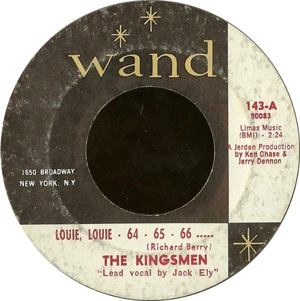

# Louie, Louie - 64 - 65 - 66 .....

By The Kingsmen

## Album Data

[Discogs URL](https://www.discogs.com/release/2441371-The-Kingsmen-Louie-Louie-64-65-66-)

- Label: Wand
- Formats: Vinyl, 7", 45 RPM, Single, Reissue, Styrene
- Genres: Rock, Rock & Roll
- Rating: 3.91
- Released: 1966
- Year: 1963
- Release ID: 2441371
- Media condition: 
- Sleeve condition: 
- Speed: 
- Weight: 
- Notes: 

## Album Tracks

| **Position** | **Title** | **Duration** |
|--------------|-----------|--------------|
| A | **Louie, Louie - 64 - 65 - 66 .....** | 2:24 |
| B | **Haunted Castle** | 2:45 |

## Artist Roles

| **Name** | **Role** |
|----------|----------|
| **Jerry Dennon** | Producer |
| **Ken Chase** | Producer |

