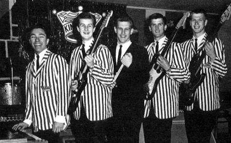

# The Kingsmen

## Artist Profile

The Kingsmen were the most successful and influential rock and roll band Oregon has produced. The band’s recording of "Louie Louie" was a nationwide hit in 1964, and it has remained one of the most popular rock songs of all time.
The band got its start in Portland in 1959 when two teenaged friends, drummer Lynn Easton and guitarist Jack Ely, started playing popular music together. By 1960, Mike Mitchell, on lead guitar, and Bob Nordby, on bass, had joined the band. Ken Chase, a local Top 40 radio personality and the owner of the Chase, a teen dance club in Milwaukie, OR, took the group under his wing, and the Kingsmen became the club’s house band in 1961. Don Gallucci joined the group on keyboards in 1962.
"Louie Louie," an R&B calypso tune about a homesick sailor, was written and recorded by Los Angeles singer Richard Berry in 1956 and became a short-lived regional hit in California. Composer Berry sold the rights to his famous song for $750 in 1959. The song was rediscovered a few years later by bands in the Seattle area. Rockin' Robin Roberts and the Wailers recorded it, and it became a regional hit in the Northwest in 1961. It was that version that became one of the most popular tunes in the Kingsmen's repertoire.
On April 6, 1963, Ken Chase met the band at a Portland recording studio to cut "Louie Louie" as its first single record. He called the recording good after the second take. The song featured vocalist Jack Ely shouting into a boom microphone suspended above his head. A thousand copies were released on the Jerden label out of Seattle. While the tune got some airplay in the Northwest, it did not become a hit until October, when an influential Boston disc jockey, Arnie "Woo Woo" Ginsberg, featured it as his "Worst Record of the Week". Many listeners loved the record, and when it was released again on the Wand label, the record began to climb the Billboard charts, primarily because of sales in the Northeast.
Meanwhile, in August 1963, the Kingsmen disbanded. Ely and Nordby quit the group over differences with Easton, who had to reconstitute the band when "Louie Louie" began gaining popularity. After several changes of personnel, the new band included Dick Peterson on drums, Norm Sundholm on bass, and Barry Curtis on keyboards. Easton replaced Ely as lead vocalist. The William Morris Agency took over management, and the Kingsmen recorded their first album and began extensive touring.
By December 14, "Louie Louie" had reached number two on the Billboard charts, where it stayed for six weeks, but the obscurity [and unintelligible lyrics] of Ely's vocal performance was causing controversy. In January, a constituent complained to Indiana Governor Matthew Welsh that an obscene record was getting radio airplay in the state. Welsh and his staff agreed that the lyrics were "pornographic," and he asked the Indiana Broadcasters Association to ban the record. The FBI launched an investigation to determine if "Louie Louie" violated the federal law prohibiting interstate transportation of obscene materials. After two and a half years, the FBI concluded that it could not determine if the lyrics were obscene because they were unintelligible. In the meantime, versions of the imaginary lyrics were circulating in high schools and college campuses all over the United States, helping to push the popularity of the Kingsmen to new heights.
The Kingsmen continued to tour and make national television appearances. They had another top-ten hit with "The Jolly Green Giant" in 1965, but their popularity had faded by the end of 1967 as musical tastes changed. The group once again disbanded. Since the 1970s, original member Mike Mitchell along with Dick Peterson and Barry Curtis have continued to perform as the Kingsmen with other musicians. Jack Ely died in 2015.
"Louie Louie" experienced a revival when it was featured in the movie Animal House in 1978. The song has been recorded by hundreds of performers and is widely acknowledged as one of the most important records in rock and roll history. "Louie Louie" was recorded in one take [some say two takes] for a one hour session that cost $36.

Members:
Mike Mitchell (1959-Died 16 Apr 2021)
Dick Peterson (1963-present)
Steve Peterson (1988-present)
Todd McPherson (1992-present)
Dennis Mitchell (2006-present)

Past members:
Lynn Easton (1959-1967)
Jack Ely (1959-1963)
Bob Nordby (1959-1963)
Don Gallucci (1962-1963)
Gary Abbott (1962-1963)
Norm Sundholm (1963-1967)
Barry Curtis (1963-2005)
Kerry Magness (1966-1967)
J.C. Reick (1966-1967)
Turley Richards (1967)
Pete Borg (1967)
Jeff Beals (1967-1968)
Steve Friedson (1967-1973)
Yank Barry (1968-1970)
Fred Dennis (1972-1984)
Andy Parypa (1982-1984)
Kim Nicklaus (1982-1984)
Marc Willett (1984-1992)
Keith Blake (1994-1999)

## Artist Links

- [https://louielouie.org/](https://louielouie.org/)
- [https://en.wikipedia.org/wiki/The_Kingsmen](https://en.wikipedia.org/wiki/The_Kingsmen)
- [https://www.oregonencyclopedia.org/articles/the_kingsmen/#.YSiTJoukJaR](https://www.oregonencyclopedia.org/articles/the_kingsmen/#.YSiTJoukJaR)
- [https://www.encyclopedia.com/education/news-wires-white-papers-and-books/kingsmen](https://www.encyclopedia.com/education/news-wires-white-papers-and-books/kingsmen)
- [https://www.imdb.com/name/nm0969456/](https://www.imdb.com/name/nm0969456/)

## See also

- [Louie, Louie - 64 - 65 - 66 .....](Louie__Louie_-_64_-_65_-_66_.md)
