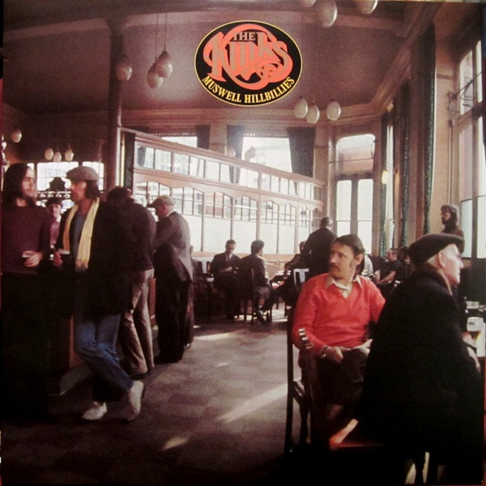

# Muswell Hillbillies

By The Kinks

## Album Data

[Discogs URL](https://www.discogs.com/release/6356036-The-Kinks-Muswell-Hillbillies)

- Label: RCA Victor
Legacy
- Formats: Vinyl
Vinyl
All Media, LP, Album, Reissue, LP, Compilation, Limited Edition, Reissue, Remastered
- Genres: Rock
- Rating: 4.7
- Released: 2014-11-28
- Year: 1971
- Release ID: 6356036
- Media condition: 
- Sleeve condition: 
- Speed: 
- Weight: 
- Notes: 

## Album Tracks

| **Position** | **Title** | **Duration** |
|--------------|-----------|--------------|
|  | **Original Album** |  |
| A1 | **20th Century Man** | 5:55 |
| A2 | **Acute Schizophrenia Paranoia Blues** | 3:30 |
| A3 | **Holiday** | 2:39 |
| A4 | **Skin And Bone** | 3:38 |
| A5 | **Alcohol** | 3:35 |
| A6 | **Complicated Life** | 4:02 |
| B1 | **Here Come The People In Grey** | 2:57 |
| B2 | **Have A Cuppa Tea** | 3:43 |
| B3 | **Holloway Jail** | 3:25 |
| B4 | **Oklahoma U.S.A.** | 2:38 |
| B5 | **Uncle Son** | 2:30 |
| B6 | **Muswell Hillbilly** | 4:56 |
|  | **Bonus Album** |  |
| C1 | **Lavender Lane** | 3:49 |
| C2 | **Mountain Woman** | 3:09 |
| C3 | **Have A Cuppa Tea (Alternate Version)** | 3:09 |
| C4 | **Uncle Son (Alternate Version)** | 2:43 |
| C5 | **Kentucky Moon** | 3:54 |
| C6 | **Nobody's Fool** | 2:36 |
| D1 | **Acute Schizophrenia Paranoia Blues (BBC Peel Session)** | 3:47 |
| D2 | **Holiday (BBC Peel Session)** | 3:08 |
| D3 | **Skin And Bone (BBC Peel Session)** | 2:34 |
| D4 | **20th Century Man (Alternate Instrumental Take)** | 3:02 |
| D5 | **Queenie (Backing Track)** | 3:41 |
| D6 | **Muswell Hillbillies Radio Spot** |  |

## Artist Roles

| **Name** | **Role** |
|----------|----------|
| **Rob Santos** | A&R |
| **John Sellards** | Art Direction, Design [Reissue] |
| **Bloomsbury Group** | Art Direction, Photography By |
| **John Dalton** | Bass |
| **The Mike Cotton Sound** | Brass |
| **Mick Avory** | Drums |
| **Barry Hammond** | Engineer [Original Recording] |
| **Gregg Jackman** | Engineer [Original Recording] |
| **Martin Levan** | Engineer [Original Recording] |
| **Mike Bobak** | Engineer [Original Recording] |
| **Mike Butcher** | Engineer [Original Recording] |
| **Roger Quested** | Engineer [Original Recording] |
| **John Gosling (2)** | Keyboards, Accordion |
| **Daniel Krieger** | Lacquer Cut By |
| **Kevin Gray** | Lacquer Cut By |
| **Dougal Lott** | Mixed By |
| **Richard Edwards** | Mixed By |
| **Albert Pinheiro** | Mixed By [Assistant] |
| **Andrew Sandoval** | Reissue Producer |
| **Vic Anesini** | Remastered By |
| **Richard Whittaker** | Transferred By [Original Analog Masters] |
| **Dave Davies** | Vocals, Guitar |
| **Ray Davies** | Vocals, Guitar, Keyboards |
| **Ray Davies** | Written-By, Producer |

