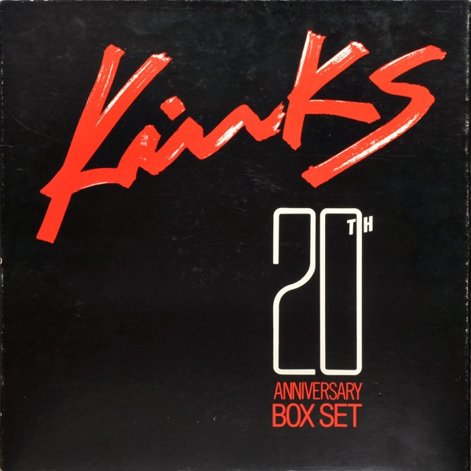

# 20th Anniversary Box Set

By The Kinks

## Album Data

[Discogs URL](https://www.discogs.com/release/599183-The-Kinks-20th-Anniversary-Box-Set)

- Label: PRT
- Formats: Vinyl
Box Set, LP, Reissue, Compilation
- Genres: Rock, Rock & Roll, Classic Rock
- Rating: 4.46
- Released: 1984
- Year: 1984
- Release ID: 599183
- Media condition: 
- Sleeve condition: 
- Speed: 
- Weight: 
- Notes: 

## Album Tracks

| **Position** | **Title** | **Duration** |
|--------------|-----------|--------------|
|  | **Kinks Greatest Hits** |  |
| A1 | **You Really Got Me** |  |
| A2 | **All Day And All Of The Night** |  |
| A3 | **Tired Of Waiting For You** |  |
| A4 | **Everybody's Gonna Be Happy** |  |
| A5 | **Set Me Free** |  |
| A6 | **See My Friends** |  |
| A7 | **Till The End Of The Day** |  |
| A8 | **Dedicated Follower Of Fashion** |  |
| A9 | **Sunny Afternoon** |  |
| B1 | **Dead End Street** |  |
| B2 | **Waterloo Sunset** |  |
| B3 | **Autumn Almanac** |  |
| B4 | **Wonder Boy** |  |
| B5 | **Days** |  |
| B6 | **Plastic Man** |  |
| B7 | **Victoria** |  |
| B8 | **Lola** |  |
| B9 | **Apeman** |  |
|  | **Kinks Kollectables ** |  |
| C1 | **I'm Not Like Everybody Else** |  |
| C2 | **This Is Where I Belong** |  |
| C3 | **Rats** |  |
| C4 | **Act Nice And Gentle** |  |
| C5 | **You Still Want Me** |  |
| C6 | **You Do Something To Me** |  |
| C7 | **I Took My Baby Home** |  |
| D1 | **Creepin' Jean** |  |
| D2 | **Hold My Hand** |  |
| D3 | **Lincoln County** |  |
| D4 | **Suzannah's Still Alive** |  |
| D5 | **Pretty Polly** |  |
| D6 | **Sittin' On My Sofa** |  |
| D7 | **Mindless Child Of Motherhood** |  |
|  | **Kinks Kovers** |  |
| E1 | **Cadillac** |  |
| E2 | **Dancing In The Street** |  |
| E3 | **Louie Louie** |  |
| E4 | **Long Tall Sally** |  |
| E5 | **Naggin' Woman** |  |
| E6 | **Too Much Monkey Business** |  |
| E7 | **Milk Cow Blues** |  |
| F1 | **Beautiful Delilah** |  |
| F2 | **Bald Headed Woman** |  |
| F3 | **I've Been Driving On Bald Mountain** |  |
| F4 | **I'm A Lover Not A Fighter** |  |
| F5 | **Long Tall Shorty** |  |
| F6 | **Got Love If You Want It** |  |

