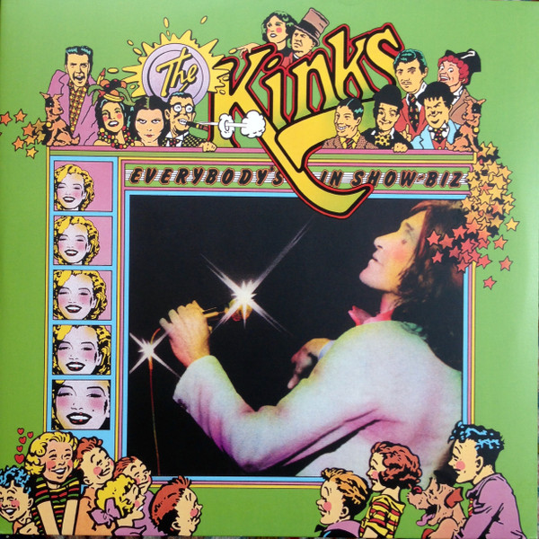

# Everybody's In Show-Biz

By The Kinks

## Album Data

[Discogs URL](https://www.discogs.com/release/8687107-The-Kinks-Everybodys-In-Show-Biz)

- Label: RCA Victor
Legacy
Sony Music
- Formats: Vinyl
Vinyl
All Media, LP, Album, Reissue, Remastered, LP
- Genres: Rock, Pop Rock
- Rating: 4.33
- Released: 2016-06-03
- Year: 1972
- Release ID: 8687107
- Media condition: 
- Sleeve condition: 
- Speed: 
- Weight: 
- Notes: 

## Album Tracks

| **Position** | **Title** | **Duration** |
|--------------|-----------|--------------|
| A1 | **Here Comes Yet Another Day** | 3:57 |
| A2 | **Maximum Consumption** | 4:02 |
| A3 | **Unreal Reality** | 3:32 |
| A4 | **Hot Potatoes** | 3:31 |
| A5 | **Sitting In My Hotel** | 3:24 |
| B1 | **Motorway** | 3:29 |
| B2 | **You Don't Know My Name** | 2:35 |
| B3 | **Supersonic Rocket Ship** | 3:30 |
| B4 | **Look A Little On The Sunny Side** | 2:48 |
| B5 | **Celluloid Heroes** | 6:20 |
| C1 | **Top Of The Pops** | 4:30 |
| C2 | **Brainwashed** | 2:59 |
| C3 | **Mr. Wonderful** | 0:43 |
| C4 | **Acute Schizophrenia Paranoia Blues** | 3:56 |
| C5 | **Holiday** | 3:51 |
| D1 | **Muswell Hillbilly** | 3:09 |
| D2 | **Alcohol** | 5:20 |
| D3 | **Banana Boat Song** | 1:40 |
| D4 | **Skin & Bone** | 3:59 |
| D5 | **Baby Face** | 1:55 |
| D6 | **Lola** | 1:40 |
|  | **Bonus Tracks** |  |
| E1 | **'Til The End Of The Day (Live)** | 2:16 |
| E2 | **You're Looking Fine (Live)** | 4:38 |
| E3 | **Get Back In Line (Live)** | 3:13 |
| E4 | **Have A Cuppa Tea (Live)** | 2:58 |
| E5 | **Sunny Afternoon (Live)** | 2:38 |
| F1 | **Complicated Life (Live)** | 3:22 |
| F2 | **Long Tall Shorty (Live)** | 5:20 |
| F3 | **History (Studio Outtake)** | 5:20 |
| F4 | **Supersonic Rocket Ship (Alternate Mix)** | 4:06 |

## Artist Roles

| **Name** | **Role** |
|----------|----------|
| **Davis, Wade & Farrell** | Art Direction, Design |
| **John Sellards** | Artwork [Restoration] |
| **Dave Jones (5)** | Baritone Saxophone, Clarinet |
| **Alan Holmes (2)** | Baritone Saxophone, Clarinet, Flute |
| **John Dalton** | Bass Guitar |
| **Mick Avory** | Drums |
| **Mike Bobak** | Engineer |
| **Barry Hammond** | Engineer [Original Recording Engineers] |
| **Martin Levan** | Engineer [Original Recording Engineers] |
| **Mike Bobak** | Engineer [Original Recording Engineers] |
| **Mike Butcher** | Engineer [Original Recording Engineers] |
| **Ray Davies** | Guitar, Vocals |
| **John Gosling (2)** | Keyboards, Accordion |
| **Kevin Gray** | Lacquer Cut By |
| **Dave Davies** | Lead Guitar, Vocals |
| **Guy Massey** | Mixed By |
| **Jørgen Angel** | Photography By [The Kinks At Roskilde] |
| **Ray Davies** | Producer |
| **Andrew Sandoval** | Producer [Reissue Producer For Sony Legacy] |
| **Vic Anesini** | Remastered By |
| **John Beecham** | Trombone, Tuba |
| **Mike Cotton** | Trumpet |
| **Ray Davies** | Words By, Music By |

