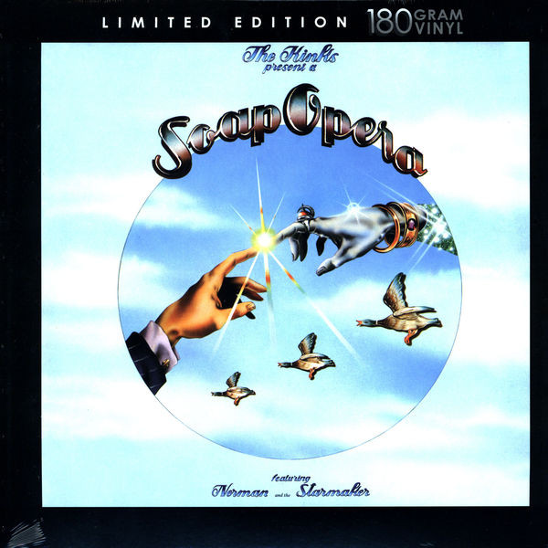

# Soap Opera

By The Kinks

## Album Data

[Discogs URL](https://www.discogs.com/release/3470486-The-Kinks-Soap-Opera)

- Label: Velvel
- Formats: Vinyl, LP, Album, Limited Edition, Reissue
- Genres: Rock, Classic Rock
- Rating: 4.1
- Released: 2008
- Year: 1975
- Release ID: 3470486
- Media condition: 
- Sleeve condition: 
- Speed: 
- Weight: 
- Notes: 

## Album Tracks

| **Position** | **Title** | **Duration** |
|--------------|-----------|--------------|
| A1 | **Everybody's A Star (Starmaker)** |  |
| A2 | **Ordinary People** |  |
| A3 | **Rush Hour Blues** |  |
| A4 | **Nine To Five** |  |
| A5 | **When Work Is Over** |  |
| A6 | **Have Another Drink** |  |
| B1 | **Underneath The Neon Sign** |  |
| B2 | **Holiday Romance** |  |
| B3 | **You Make It All Worthwhile** |  |
| B4 | **Ducks On The Wall** |  |
| B5 | **(A) Face In The Crowd** |  |
| B6 | **You Can't Stop The Music** |  |

## Artist Roles

| **Name** | **Role** |
|----------|----------|
| **Pat Doyle (2)** | Art Direction |
| **Joe Petagno** | Illustration |
| **Ray Davies** | Written-By, Arranged By, Producer |

