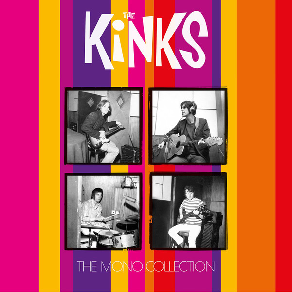

# The Mono Collection

By The Kinks

## Album Data

[Discogs URL](https://www.discogs.com/release/9540202-The-Kinks-The-Mono-Collection)

- Label: BMG
ABKCO
- Formats: Box Set
Vinyl
Vinyl
Vinyl
Vinyl
Vinyl
Vinyl
Vinyl
Vinyl
Vinyl
All Media, Compilation, Limited Edition, LP, Album, LP, Album, LP, Album, LP, Album, LP, Album, LP, Album, LP, Album, LP, Album, LP, Compilation, Reissue, Remastered, Mono
- Genres: Rock
- Rating: 4.95
- Released: 2016-12-16
- Year: 2016
- Release ID: 9540202
- Media condition: 
- Sleeve condition: 
- Speed: 
- Weight: 
- Notes: 

## Album Tracks

| **Position** | **Title** | **Duration** |
|--------------|-----------|--------------|
|  | **Kinks** |  |
| A1 | **Beautiful Delilah** | 2:08 |
| A2 | **So Mystifying** | 2:55 |
| A3 | **Just Can't Go To Sleep** | 2:00 |
| A4 | **Long Tall Shorty** | 2:51 |
| A5 | **I Took My Baby Home** | 1:49 |
| A6 | **I'm A Lover Not A Fighter** | 2:05 |
| A7 | **You Really Got Me** | 2:17 |
| B1 | **Cadillac** | 2:46 |
| B2 | **Bald Headed Woman** | 2:43 |
| B3 | **Revenge** | 1:31 |
| B4 | **Too Much Monkey Business** | 2:17 |
| B5 | **I've Been Driving On Bald Mountain** | 2:03 |
| B6 | **Stop Your Sobbing** | 2:07 |
| B7 | **Got Love If You Want It** | 3:49 |
|  | **Kinda Kinks** |  |
| C1 | **Look For Me Baby** | 2:17 |
| C2 | **Got My Feet On The Ground** | 2:16 |
| C3 | **Nothin' In The World Can Stop Me Worryin' 'Bout That Girl** | 2:46 |
| C4 | **Naggin' Woman** | 2:38 |
| C5 | **Wonder Where My Baby Is Tonight** | 2:02 |
| C6 | **Tired Of Waiting For You** | 2:35 |
| D1 | **Dancing In The Street** | 2:21 |
| D2 | **Don't Ever Change** | 2:25 |
| D3 | **Come On Now** | 1:49 |
| D4 | **So Long** | 2:11 |
| D5 | **You Shouldn't Be Sad** | 2:02 |
| D6 | **Something Better Beginning** | 2:26 |
|  | **The Kink Kontroversy** |  |
| E1 | **Milk Cow Blues** | 3:43 |
| E2 | **Ring The Bells** | 2:20 |
| E3 | **Gotta Get The First Plane Home** | 1:49 |
| E4 | **When I See That Girl Of Mine** | 2:13 |
| E5 | **I Am Free** | 2:30 |
| E6 | **Till The End Of The Day** | 2:24 |
| F1 | **The World Keeps Going Round** | 2:37 |
| F2 | **I'm On An Island** | 2:18 |
| F3 | **Where Have All The Good Times Gone** | 2:52 |
| F4 | **It's Too Late** | 2:35 |
| F5 | **What's In Store For Me** | 2:07 |
| F6 | **You Can't Win** | 2:41 |
|  | **Face To Face** |  |
| G1 | **Party Line** | 2:38 |
| G2 | **Rosy Won't You Please Come Home** | 2:36 |
| G3 | **Dandy** | 2:14 |
| G4 | **Too Much On My Mind** | 2:32 |
| G5 | **Session Man** | 2:22 |
| G6 | **Rainy Day In June** | 3:19 |
| G7 | **House In The Country** | 3:09 |
| H1 | **Holiday In Waikiki** | 2:55 |
| H2 | **Most Exclusive Residence For Sale** | 2:50 |
| H3 | **Fancy** | 2:31 |
| H4 | **Little Miss Queen Of Darkness** | 3:21 |
| H5 | **You're Looking Fine** | 2:53 |
| H6 | **Sunny Afternoon** | 3:40 |
| H7 | **I'll Remember** | 2:33 |
|  | **Something Else By The Kinks** |  |
| I1 | **David Watts** | 2:33 |
| I2 | **Death Of A Clown** | 3:05 |
| I3 | **Two Sisters** | 2:03 |
| I4 | **No Return** | 2:03 |
| I5 | **Harry Rag** | 2:17 |
| I6 | **Tin Soldier Man** | 2:50 |
| I7 | **Situation Vacant** | 3:19 |
| J1 | **Love Me Till The Sun Shines** | 3:19 |
| J2 | **Lazy Old Sun** | 2:49 |
| J3 | **Afternoon Tea** | 3:27 |
| J4 | **Funny Face** | 2:18 |
| J5 | **End Of The Season** | 2:58 |
| J6 | **Waterloo Sunset** | 3:17 |
|  | **Live At Kelvin Hall** |  |
| K1 | **Till The End Of The Day** | 3:22 |
| K2 | **A Well Respected Man** | 3:10 |
| K3 | **You're Looking Fine** | 3:30 |
| K4 | **Sunny Afternoon** | 4:54 |
| K5 | **Dandy** | 2:05 |
| L1 | **I'm On An Island** | 2:54 |
| L2 | **Come On Now** | 3:01 |
| L3 | **You Really Got Me** | 2:13 |
| L4 | **Medley: Milk Cow Blues / Batman Theme / Tired Of Waiting For You / Milk Cow Blues** | 8:55 |
|  | **The Kinks Are The Village Green Preservation Society** |  |
| M1 | **The Village Green Preservation Society** | 2:53 |
| M2 | **Do You Remember Walter?** | 2:27 |
| M3 | **Picture Book** | 2:36 |
| M4 | **Johnny Thunder** | 2:31 |
| M5 | **Last Of The Steam-Powered Trains** | 4:11 |
| M6 | **Big Sky** | 2:51 |
| M7 | **Sitting By The Riverside** | 2:24 |
| N1 | **Animal Farm** | 3:01 |
| N2 | **Village Green** | 2:11 |
| N3 | **Starstruck** | 2:27 |
| N4 | **Phenomenal Cat** | 2:39 |
| N5 | **All Of My Friends Were There** | 2:25 |
| N6 | **Wicked Annabella** | 2:43 |
| N7 | **Monica** | 2:20 |
| N8 | **People Take Pictures Of Each Other** | 2:19 |
|  | **Arthur (Or The Decline And Fall Of The British Empire)** |  |
| O1 | **Victoria** | 3:43 |
| O2 | **Yes Sir, No Sir** | 3:50 |
| O3 | **Some Mother's Son** | 3:27 |
| O4 | **Drivin'** | 3:15 |
| O5 | **Brainwashed** | 2:37 |
| O6 | **Australia** | 6:46 |
| P1 | **Shangri-La** | 5:23 |
| P2 | **Mr. Churchill Says** | 4:44 |
| P3 | **She's Bought A Hat Like Princess Marina** | 3:10 |
| P4 | **Young And Innocent Days** | 3:24 |
| P5 | **Nothing To Say** | 3:10 |
| P6 | **Arthur** | 5:28 |
|  | **The Kinks** |  |
| Q1 | **You Really Got Me** | 2:17 |
| Q2 | **Long Tall Shorty** | 2:51 |
| Q3 | **All Day And All Of The Night** | 2:42 |
| Q4 | **Beautiful Delilah** | 2:08 |
| Q5 | **Tired Of Waiting For You** | 2:35 |
| Q6 | **I'm A Lover Not A Fighter** | 2:05 |
| R1 | **A Well Respected Man** | 2:40 |
| R2 | **Till The End Of The Day** | 2:24 |
| R3 | **See My Friends** | 2:44 |
| R4 | **Don't You Fret** | 2:45 |
| R5 | **Dedicated Follower Of Fashion** | 3:01 |
| R6 | **Sunny Afternoon** | 3:40 |
| S1 | **Dead End Street** | 3:22 |
| S2 | **Death Of A Clown** | 3:05 |
| S3 | **Two Sisters** | 2:03 |
| S4 | **Big Black Smoke** | 2:31 |
| S5 | **Susannah's Still Alive** | 2:20 |
| S6 | **Autumn Almanac** | 3:03 |
| T1 | **Waterloo Sunset** | 3:17 |
| T2 | **Last Of The Steam-Powered Trains** | 4:11 |
| T3 | **Wonderboy** | 2:48 |
| T4 | **Do You Remember Walter?** | 2:27 |
| T5 | **Dandy** | 2:14 |
| T6 | **Animal Farm** | 3:01 |
| T7 | **Days** | 2:55 |

## Artist Roles

| **Name** | **Role** |
|----------|----------|
| **Dave Davies** | Arranged By |
| **Ray Davies** | Arranged By |
| **The Kinks** | Arranged By |
| **The Kinks** | Art Direction [Arthur (Or The Decline And Fall Of The British Empire)] |
| **John Sellards** | Artwork [LP Artwork] |
| **Pete Quaife** | Bass |
| **Andrew Sandoval** | Compiled By |
| **Lew Warburton** | Conductor [Brass & Strings Conducted By] |
| **Bob Lawrie (2)** | Design [Arthur (Or The Decline And Fall Of The British Empire)], Artwork [Arthur (Or The Decline And Fall Of The British Empire)] |
| **Phil Smee** | Design [Package Design], Artwork [Package Artwork] |
| **Pye Records Studios** | Design [Sleeve Design, Something Else By The Kinks], Art Direction [Something Else By The Kinks] |
| **Pye Records Studios** | Design [Sleeve Design, The Kinks Are The Village Green Preservation Society], Art Direction [The Kinks Are The Village Green Preservation Society] |
| **Didier Dehauteur** | Directed By [Project Director] |
| **Mick Avory** | Drums |
| **Alan McKenzie** | Engineer |
| **Andy Hendriksen** | Engineer |
| **Brian Humphries** | Engineer |
| **Irish (2)** | Engineer |
| **Alan O'Duffy** | Engineer [Ass. Engineers] |
| **Vic Maile** | Engineer [Ass. Engineers] |
| **Ray Davies** | Guitar, Keyboards, Vocals |
| **Dave Davies** | Guitar, Vocals |
| **Nicky Hopkins** | Harpsichord |
| **Kevin Gray** | Lacquer Cut By |
| **Andy Neill** | Liner Notes, Interviewer |
| **Doug Hinman** | Management [Project Assistance] |
| **John Digilio** | Management [Project Assistance] |
| **Kelly Gateson** | Management [Project Assistance] |
| **Saskia Pels** | Management [Project Assistance] |
| **Elliot Stubbs** | Management [Project Manager] |
| **Kevin Gray** | Mastered By |
| **Ray Davies** | Music Director |
| **Mark Hayward (4)** | Photography By [Photographs Provided By] |
| **Mike Leale** | Photography By [Something Else By The Kinks] |
| **John Prosser (3)** | Photography By [The Kinks Are The Village Green Preservation Society] |
| **Ray Davies** | Producer |
| **Shel Talmy** | Producer |
| **Shel Talmy** | Recorded By |
| **Frank Smyth** | Sleeve Notes [Face To Face] |
| **Brian Sommerville** | Sleeve Notes [Kinks] |
| **Michael Aldred** | Sleeve Notes [The Kink Kontroversy] |
| **Julian Mitchell** | Written-By [Original Story Of Arthur, Arthur (Or The Decline And Fall Of The British Empire)] |
| **Ray Davies** | Written-By [Original Story Of Arthur, Arthur (Or The Decline And Fall Of The British Empire)] |

