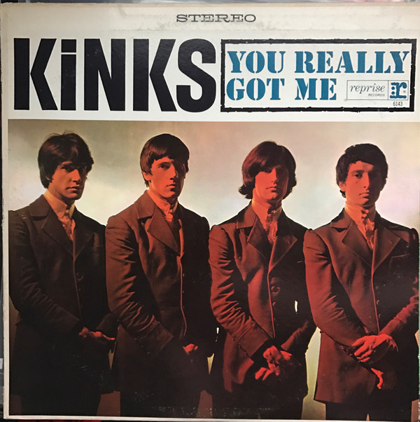

# You Really Got Me

By The Kinks

## Album Data

[Discogs URL](https://www.discogs.com/release/6912832-The-Kinks-You-Really-Got-Me)

- Label: Sanctuary Records
- Formats: Vinyl, 7", 45 RPM, Single, Limited Edition
- Genres: Rock, Blues Rock, Beat
- Rating: 4.47
- Released: 2015-04-18
- Year: 2015
- Release ID: 6912832
- Media condition: 
- Sleeve condition: 
- Speed: 
- Weight: 
- Notes: 

## Album Tracks

| **Position** | **Title** | **Duration** |
|--------------|-----------|--------------|
| A | **You Really Got Me** | 2:10 |
| B | **Milk Cow Blues** | 2:21 |

## Artist Roles

| **Name** | **Role** |
|----------|----------|
| **Pete Quaife** | Bass Guitar |
| **Mick Avory** | Drums |
| **Dave Davies** | Guitar |
| **Kevin Gray** | Lacquer Cut By |
| **Ray Davies** | Lead Vocals, Guitar |

