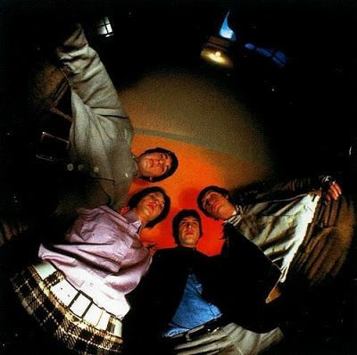

# The Kinks

## Artist Profile

The Kinks are an English rock band formed in Muswell Hill, North London, in 1964 by brothers Ray and Dave Davies, Mick Avory and Pete Quaife. During their existence they have played different styles of rock ('n' roll) music.

Pete Quaife left The Kinks during the Arthur Or The Decline And Fall Of The British Empire rehearsals. In a June 2018 interview, Ray Davies stated that he, along with brother Dave, and drummer Avory, had reformed The Kinks for a new studio album and to potentially perform live.

Inducted into Rock And Roll Hall of Fame in 1990 (Performer).

## Artist Links

- [https://thekinks.info/](https://thekinks.info/)
- [https://www.facebook.com/TheKinksOfficial](https://www.facebook.com/TheKinksOfficial)
- [https://twitter.com/TheKinks](https://twitter.com/TheKinks)
- [https://www.youtube.com/user/TheKinksMusic](https://www.youtube.com/user/TheKinksMusic)
- [http://www.kindakinks.net/](http://www.kindakinks.net/)
- [https://en.wikipedia.org/wiki/The_Kinks](https://en.wikipedia.org/wiki/The_Kinks)

## See also

- [20th Anniversary Box Set](20th_Anniversary_Box_Set.md)
- [Everybody's In Show-Biz](Everybodys_In_Show-Biz.md)
- [Father Christmas / (Wish I Could Fly Like) Superman](Father_Christmas_-_Wish_I_Could_Fly_Like_Superman.md)
- [Muswell Hillbillies](Muswell_Hillbillies.md)
- [Preservation Act 1](Preservation_Act_1.md)
- [Sleepwalker](Sleepwalker.md)
- [Soap Opera](Soap_Opera.md)
- [The Mono Collection](The_Mono_Collection.md)
- [You Really Got Me](You_Really_Got_Me.md)
