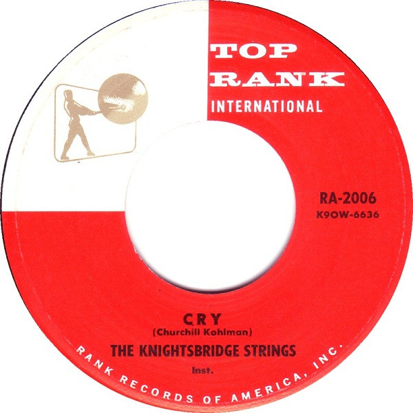

# Cry

By The Knightsbridge Strings

## Album Data

[Discogs URL](https://www.discogs.com/release/4092801-The-Knightsbridge-Strings-Cry)

- Label: Top Rank International
- Formats: Vinyl, 7", 45 RPM, Single
- Genres: Jazz, Pop, Easy Listening, Instrumental
- Rating: 2
- Released: 1959
- Year: 1959
- Release ID: 4092801
- Media condition: 
- Sleeve condition: 
- Speed: 
- Weight: 
- Notes: 

## Album Tracks

| **Position** | **Title** | **Duration** |
|--------------|-----------|--------------|
| A | **Cry** |  |
| B | **My Prayer** |  |

