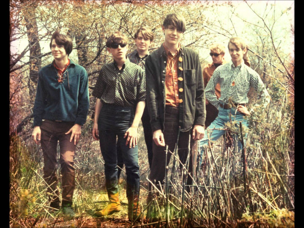

# The Lemon Drops

## Artist Profile

Psychedelic pop band from Chicago, Illinois, USA, that formed in 1966.
The band, originally established by high school students, produced one single in their heyday that reached regional success, but also recorded several other unreleased material that garnered the group's re-interest in the 1980s. During their existence, the band was an essential piece in the development of psychedelic pop in Illinois.
Evolved into Buzzsaw (4).

## Artist Links

- [http://www.cicadelic.com/ld984.htm](http://www.cicadelic.com/ld984.htm)
- [https://en.wikipedia.org/wiki/The_Lemon_Drops](https://en.wikipedia.org/wiki/The_Lemon_Drops)

## See also

- [Sunshower Flower Power](Sunshower_Flower_Power.md)
