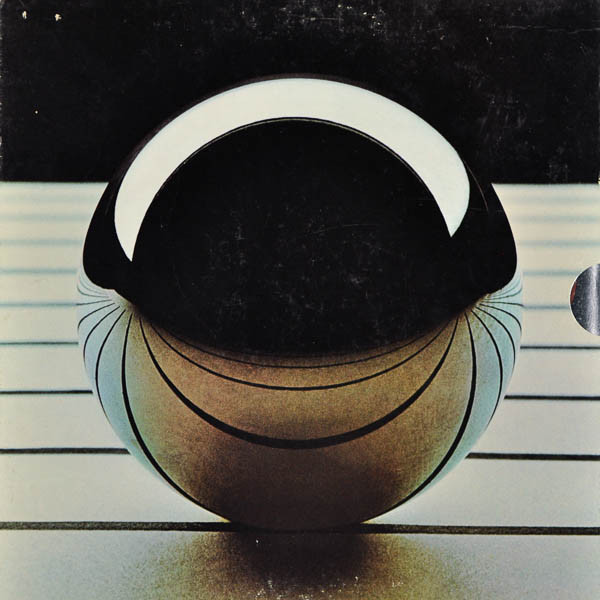

# Tommy / As Performed By The London Symphony Orchestra And Chambre Choir With Guest Soloists

By The London Symphony Orchestra

## Album Data

[Discogs URL](https://www.discogs.com/release/1328540-The-London-Symphony-Orchestra-And-Chambre-Choir-Tommy-As-Performed-By-The-London-Symphony-Orchestra-)

- Label: Ode Records (2)
- Formats: Vinyl
Box Set, LP, Album
- Genres: Rock, Classical, Modern Classical, Choral
- Rating: 3.68
- Released: 1972
- Year: 1972
- Release ID: 1328540
- Media condition: 
- Sleeve condition: 
- Speed: 
- Weight: 
- Notes: 

## Album Tracks

| **Position** | **Title** | **Duration** |
|--------------|-----------|--------------|
| A1 | **Overture** |  |
| A2 | **It's A Boy** |  |
| A3 | **1921** |  |
| A4 | **Amazing Journey** |  |
| A5 | **Sparks** |  |
| A6 | **Eyesight To The Blind** |  |
| A7 | **Christmas** |  |
| B1 | **Cousin Kevin** |  |
| B2 | **The Acid Queen** |  |
| B3 | **Underture** |  |
| B4 | **Do You Think It's All Right** |  |
| B5 | **Fiddle About** |  |
| B6 | **Pin Ball Wizard** |  |
| C1 | **There's A Doctor I've Found** |  |
| C2 | **Go To The Mirror Boy** |  |
| C3 | **Tommy Can You Hear Me?** |  |
| C4 | **Smash The Mirror** |  |
| C5 | **I'm Free** |  |
| C6 | **Miracle Cure** |  |
| C7 | **Sensation** |  |
| D1 | **Sally Simpson** |  |
| D2 | **Welcome** |  |
| D3 | **Tommy's Holiday Camp** |  |
| D4 | **We're Not Gonna Take It** |  |
| D5 | **See Me, Feel Me** |  |

## Artist Roles

| **Name** | **Role** |
|----------|----------|
| **Wil Malone** | Arranged By |
| **Big Jim Sullivan** | Arranged By [Additional Arrangements] |
| **David Measham** | Conductor, Directed By |
| **Anton Matthews** | Engineer [Assistant] |
| **Bob Potter** | Engineer [Assistant] |
| **Mike Bobak** | Engineer [Assistant] |
| **Keith Grant** | Engineer [Chief] |
| **Tom Carnase** | Graphics [Logotype] |
| **Tom Wilkes (2)** | Graphics [Logotype] |
| **Wilkes & Braun Inc.** | Graphics, Design Concept |
| **David Edward Byrd** | Illustration [Acid Queen] |
| **Doug Johnson (7)** | Illustration [Cousin Kevin] |
| **Richard Harvey (7)** | Illustration [Doctor] |
| **Wilson McClean** | Illustration [Father] |
| **Alex Gnidziejko** | Illustration [Hawker] |
| **Charles E. White III** | Illustration [Local Lad] |
| **Jim Manos** | Illustration [Mother] |
| **Richard Amsel** | Illustration [Narrator] |
| **Robert Heindel** | Illustration [Nurse] |
| **Mark English (5)** | Illustration [Tommy] |
| **Robert Grossmann** | Illustration [Uncle Ernie] |
| **Lee Hulko** | Mastered By |
| **Pete Townshend** | Narrator |
| **Merry Clayton** | Performer [Acid Queen] |
| **John Entwistle** | Performer [Cousin Kevin] |
| **Richard Harris** | Performer [Doctor] |
| **Steve Winwood** | Performer [Father] |
| **Richie Havens** | Performer [Hawker] |
| **Rod Stewart** | Performer [Local Lad] |
| **Graham Bell** | Performer [Lover] |
| **Maggie Bell** | Performer [Mother] |
| **Sandy Denny** | Performer [Nurse] |
| **Roger Daltrey** | Performer [Tommy] |
| **Ringo Starr** | Performer [Uncle Ernie] |
| **Ethan Russell** | Photography By [Location] |
| **Tom Wilkes (2)** | Photography By [Location] |
| **Phil Marco** | Photography By [Stills] |
| **Lou Reizner** | Producer |
| **Kit Lambert** | Producer [The Who´s Original Recording Of Tommy] |
| **John Entwistle** | Written-By |
| **Keith Moon** | Written-By |
| **Pete Townshend** | Written-By |
| **Sonny Boy Williamson (2)** | Written-By |

