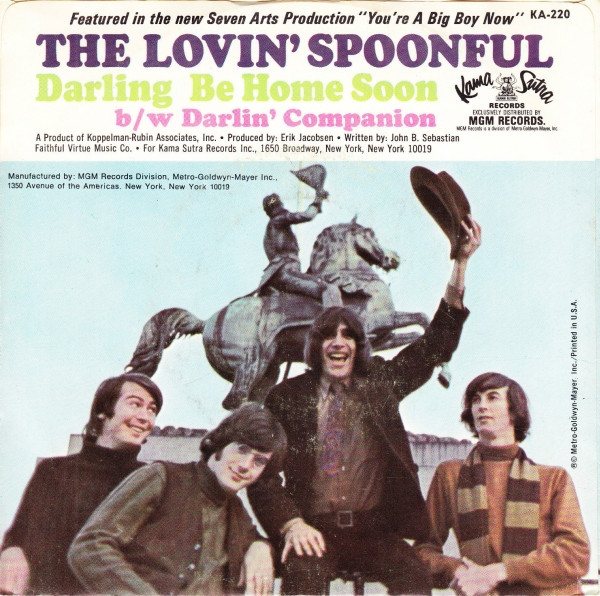

# Darling Be Home Soon / Darlin' Companion

By The Lovin' Spoonful

## Album Data

[Discogs URL](https://www.discogs.com/release/5573946-The-Lovin-Spoonful-Darling-Be-Home-Soon-Darlin-Companion)

- Label: Kama Sutra
Kama Sutra
- Formats: Vinyl, 7", 45 RPM, Single
- Genres: Rock, Pop, Pop Rock
- Rating: 5
- Released: 1967
- Year: 1967
- Release ID: 5573946
- Media condition: 
- Sleeve condition: 
- Speed: 
- Weight: 
- Notes: 

## Album Tracks

| **Position** | **Title** | **Duration** |
|--------------|-----------|--------------|
| A | **Darling Be Home Soon** | 3:32 |
| B | **Darlin' Companion** | 2:22 |

## Artist Roles

| **Name** | **Role** |
|----------|----------|
| **Erik Jacobsen** | Producer [Produced By] |
| **John Sebastian** | Written-By |

