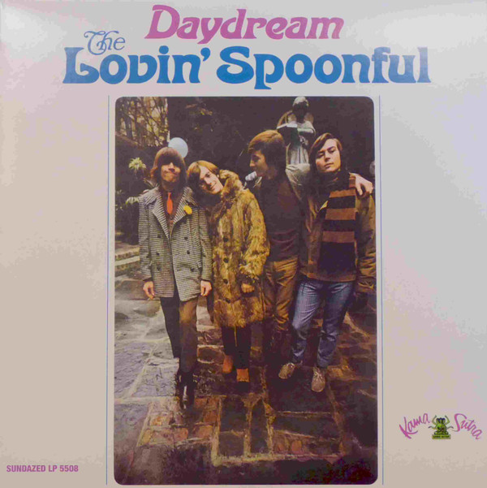

# Daydream

By The Lovin' Spoonful

## Album Data

[Discogs URL](https://www.discogs.com/release/7152886-The-Lovin-Spoonful-Daydream)

- Label: Sundazed Music
- Formats: Vinyl, LP, Album, Mono
- Genres: Rock, Pop, Pop Rock
- Rating: 4.5
- Released: 2015
- Year: 1966
- Release ID: 7152886
- Media condition: 
- Sleeve condition: 
- Speed: 
- Weight: 
- Notes: 

## Album Tracks

| **Position** | **Title** | **Duration** |
|--------------|-----------|--------------|
| A1 | **Daydream** | 2:23 |
| A2 | **There She Is** | 1:55 |
| A3 | **It's Not Time Now** | 2:45 |
| A4 | **Warm Baby** | 2:00 |
| A5 | **Day Blues** | 3:12 |
| A6 | **Let The Boy Rock And Roll** | 2:32 |
| B1 | **Jug Band Music** | 2:49 |
| B2 | **Didn't Want To Have To Do It** | 2:06 |
| B3 | **You Didn't Have To Be So Nice** | 2:29 |
| B4 | **Bald Headed Lena** | 2:22 |
| B5 | **Butchie's Tune** | 2:34 |
| B6 | **Big Noise From Speonk** | 2:48 |

## Artist Roles

| **Name** | **Role** |
|----------|----------|
| **Steve Boone** | Bass, Piano |
| **Michael Malatak** | Design [Cover Design] |
| **Joe Butler** | Drums |
| **Val Valentin** | Engineer |
| **John Sebastian** | Guitar, Harmonica, Autoharp |
| **John Sebastian** | Lead Guitar |
| **Zal Yanovsky** | Lead Guitar |
| **Alan Brooks (3)** | Photography By [Cover] |
| **Erik Jacobsen** | Producer |

