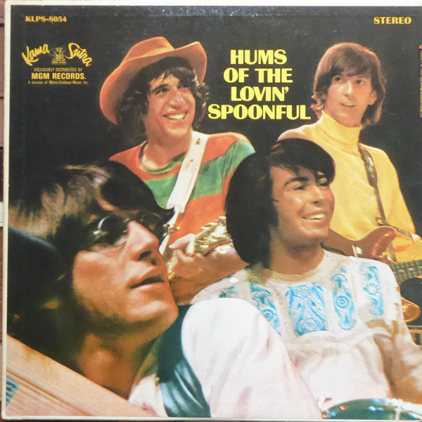

# Hums Of The Lovin' Spoonful

By The Lovin' Spoonful

## Album Data

[Discogs URL](https://www.discogs.com/release/9070500-The-Lovin-Spoonful-Hums-Of-The-Lovin-Spoonful)

- Label: Kama Sutra
Sony Music
Sundazed Music
- Formats: Vinyl, LP, Album, Mono
- Genres: Rock, Pop Rock, Folk Rock
- Rating: 4.9
- Released: 2015
- Year: 1966
- Release ID: 9070500
- Media condition: 
- Sleeve condition: 
- Speed: 
- Weight: 
- Notes: 

## Album Tracks

| **Position** | **Title** | **Duration** |
|--------------|-----------|--------------|
| A1 | **Lovin' You** | 2:25 |
| A2 | **Bes' Friends** | 1:52 |
| A3 | **Voodoo In My Basement** | 2:35 |
| A4 | **Darlin' Companion** | 2:22 |
| A5 | **Henry Thomas** | 1:40 |
| A6 | **Full Measure** | 2:40 |
| B1 | **Rain On The Roof** | 2:13 |
| B2 | **Coconut Grove** | 2:38 |
| B3 | **Nashville Cats** | 2:34 |
| B4 | **4 Eyes** | 2:53 |
| B5 | **Summer In The City** | 2:39 |

## Artist Roles

| **Name** | **Role** |
|----------|----------|
| **Henry Diltz** | Clarinet, Photography By |
| **Larry Hankin** | Jew's Harp |
| **Kevin Gray** | Lacquer Cut By |
| **Erik Jacobsen** | Producer |
| **John Sebastian** | Written-By |
| **Mark Sebastian** | Written-By |
| **Steve Boone** | Written-By |
| **Zal Yanovsky** | Written-By |

