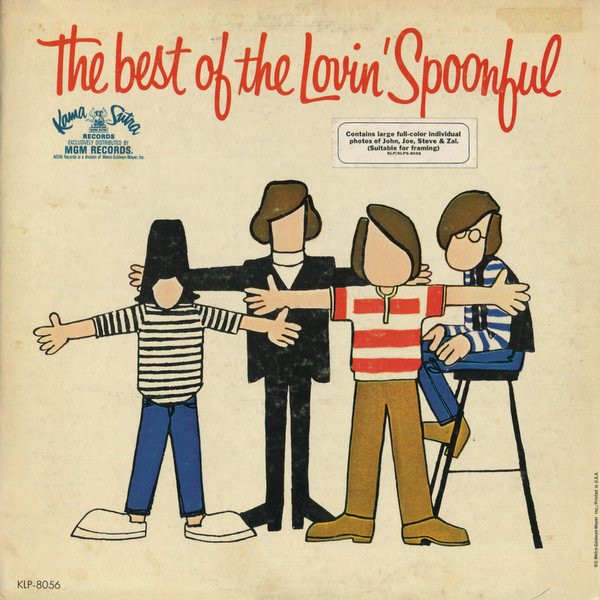

# The Best Of The Lovin' Spoonful

By The Lovin' Spoonful

## Album Data

[Discogs URL](https://www.discogs.com/release/1205127-The-Lovin-Spoonful-The-Best-Of-The-Lovin-Spoonful)

- Label: Kama Sutra
Kama Sutra
- Formats: Vinyl, LP, Compilation, Mono
- Genres: Rock, Pop, Pop Rock, Folk Rock
- Rating: 3.98
- Released: 1967
- Year: 1967
- Release ID: 1205127
- Media condition: 
- Sleeve condition: 
- Speed: 
- Weight: 
- Notes: 

## Album Tracks

| **Position** | **Title** | **Duration** |
|--------------|-----------|--------------|
| A1 | **Do You Believe In Magic** | 2:04 |
| A2 | **Did You Ever Have To Make Up Your Mind** | 2:00 |
| A3 | **Butchie's Tune** | 2:34 |
| A4 | **Jug Band Music** | 2:49 |
| A5 | **Night Owl Blues** | 3:00 |
| A6 | **You Didn't Have To Be So Nice** | 2:29 |
| B1 | **Daydream** | 2:18 |
| B2 | **Blues In The Bottle** | 2:10 |
| B3 | **Didn't Want To Have To Do It** | 2:06 |
| B4 | **Wild About My Lovin'** | 2:38 |
| B5 | **Younger Girl** | 2:23 |
| B6 | **Summer In The City** | 2:39 |

## Artist Roles

| **Name** | **Role** |
|----------|----------|
| **Chrystal Starr Russell** | Cover, Artwork |
| **Acy Lehman** | Cover, Design |
| **Val Valentin** | Engineer |
| **Bob Cavallo** | Management |
| **Erik Jacobsen** | Producer |
| **John Sebastian** | Written-By |
| **Steve Boone** | Written-By |

