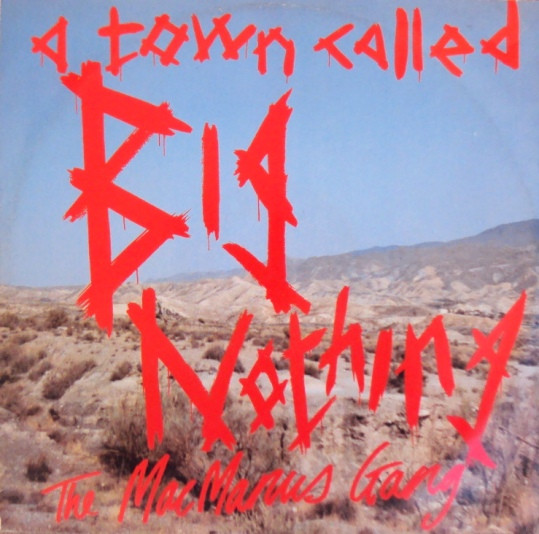

# A Town Called Big Nothing

By The MacManus Gang

## Album Data

[Discogs URL](https://www.discogs.com/release/1050133-The-MacManus-Gang-A-Town-Called-Big-Nothing)

- Label: Demon Records
Demon Records
- Formats: Vinyl, 12", 45 RPM, Single
- Genres: Rock, Alternative Rock
- Rating: 3.79
- Released: 1987-05-00
- Year: 1987
- Release ID: 1050133
- Media condition: 
- Sleeve condition: 
- Speed: 
- Weight: 
- Notes: 

## Album Tracks

| **Position** | **Title** | **Duration** |
|--------------|-----------|--------------|
| A | **A Town Called Big Nothing (Really Big Nothing)** |  |
| B1 | **Return To Big Nothing** |  |
| B2 | **A Town Called Big Nothing (The Long March)** |  |

## Artist Roles

| **Name** | **Role** |
|----------|----------|
| **Declan Patrick Aloysius MacManus** | Composed By |
| **Pete Thomas** | Drums |
| **Declan Patrick Aloysius MacManus** | Guitar, Bass, Vocals, Percussion |
| **Tim Young** | Mastered By |
| **Steve Hart (3)** | Piano |
| **Declan Patrick Aloysius MacManus** | Producer |
| **Colin Fairley** | Recorded By |
| **Ross McManus** | Trumpet, Handclaps |
| **Cait O'Riordan** | Vocals |
| **Sy Richardson** | Voice [Speaking Voice] |

