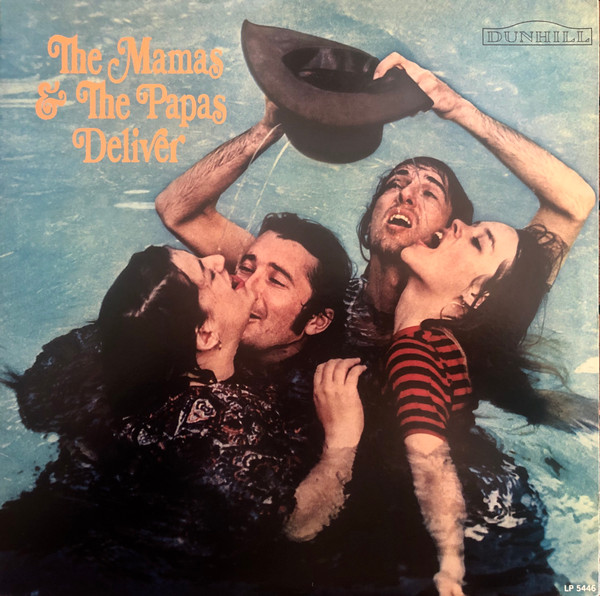

# Deliver

By The Mamas & The Papas

## Album Data

[Discogs URL](https://www.discogs.com/release/5012577-The-Mamas-The-Papas-Deliver)

- Label: Sundazed Music
- Formats: Vinyl, LP, Album, Reissue, Stereo
- Genres: Rock, Folk Rock
- Rating: 4.33
- Released: 2013
- Year: 1967
- Release ID: 5012577
- Media condition: 
- Sleeve condition: 
- Speed: 
- Weight: 
- Notes: 

## Album Tracks

| **Position** | **Title** | **Duration** |
|--------------|-----------|--------------|
| A1 | **Dedicated To The One I Love** | 2:56 |
| A2 | **My Girl** | 3:35 |
| A3 | **Creeque Alley** | 3:45 |
| A4 | **Sing For Your Supper** | 2:46 |
| A5 | **Twist And Shout** | 2:45 |
| A6 | **Free Advice** | 3:15 |
| B1 | **Look Through My WIndow** | 3:05 |
| B2 | **Boys & Girls Together** | 3:15 |
| B3 | **String Man** | 2:59 |
| B4 | **Frustration** | 2:50 |
| B5 | **Did You Ever Want To Cry** | 2:53 |
| B6 | **John's Music Box** | 1:00 |

