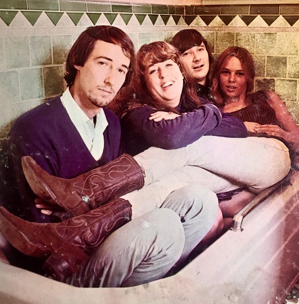

# The Mamas & The Papas

## Artist Profile

John Phillips, Michelle Phillips and Denny Doherty performed in the New Journeymen, a temporary group put together to fulfill contractual obligations after the original trio’s breakup. In 1965, the three of them headed to St. Thomas, in the US Virgin Islands, to write and to rehearse. They were joined by the alto-voiced Cass Elliot. The foursome relocated to Los Angeles, where they signed to Lou Adler’s Dunhill label. After briefly calling themselves the Magic Circle, they took the name The Mamas and The Papas.

They broke up in 1968 and reunited briefly in 1971. In 1982, the group was reformed, including founding member Denny Doherty and two new “Mamas”: Mackenzie Phillips (daughter of John) and Elaine “Spanky” McFarlane, a longtime friend who had sung with Spanky and Our Gang. Another version of the band, including only John Phillips from the original line-up, released the live album 'Californa Dreamin: Live in Concert' in 1995.
Owners of Honest John Studios, built in John & Michelle Phillips' home at Bel Air, California.

The Mamas and The Papas were inducted into the Rock And Roll Hall of Fame in 1998 (Performer).

## Artist Links

- [http://www.themamasandthepapasofficial.com/](http://www.themamasandthepapasofficial.com/)
- [https://www.facebook.com/mamasandthepapas](https://www.facebook.com/mamasandthepapas)
- [https://www.instagram.com/MamasPapasMusic](https://www.instagram.com/MamasPapasMusic)
- [https://twitter.com/MamasPapasMusic](https://twitter.com/MamasPapasMusic)
- [https://en.wikipedia.org/wiki/The_Mamas_%26_the_Papas](https://en.wikipedia.org/wiki/The_Mamas_%26_the_Papas)

## See also

- [Deliver](Deliver.md)
