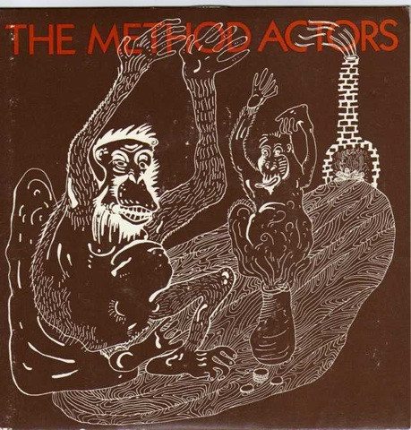

# Rang-A-Tang / Big Red Brain

By The Method Actors

## Album Data

[Discogs URL](https://www.discogs.com/release/2274400-The-Method-Actors-Rang-A-Tang-Big-Red-Brain)

- Label: Press
- Formats: Vinyl, 7"
- Genres: Rock, New Wave, Punk
- Rating: 0
- Released: 1982
- Year: 1982
- Release ID: 2274400
- Media condition: 
- Sleeve condition: 
- Speed: 
- Weight: 
- Notes: 

## Album Tracks

| **Position** | **Title** | **Duration** |
|--------------|-----------|--------------|
| A | **Rang-A-Tang** |  |
| B | **Big Red Brain** |  |

## Artist Roles

| **Name** | **Role** |
|----------|----------|
| **Sam Seawright** | Artwork [Cover Art] |
| **Peter Woolliscroft** | Producer |
| **Vic Varney** | Producer |

