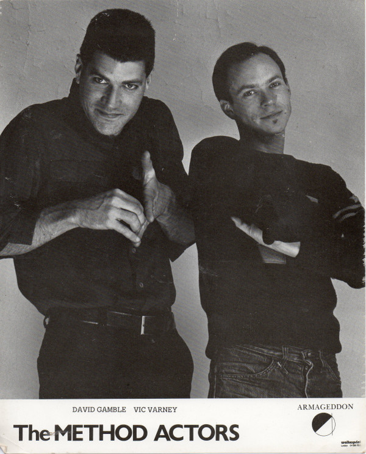

# The Method Actors

## Artist Profile

The Method Actors were an American post-punk/new wave musical group from Athens, Georgia, United States, founded by Vic Varney and David Gamble in 1979 while at the University of Georgia.

## Artist Links

- [http://www.myspace.com/19345422](http://www.myspace.com/19345422)
- [https://en.wikipedia.org/wiki/The_Method_Actors](https://en.wikipedia.org/wiki/The_Method_Actors)

## See also

- [Rang-A-Tang / Big Red Brain](Rang-A-Tang_-_Big_Red_Brain.md)
