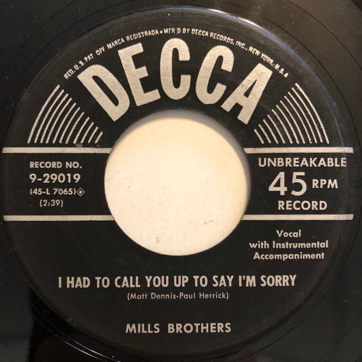

# I Had To Call You Up To Say I'm Sorry

By The Mills Brothers

## Album Data

[Discogs URL](https://www.discogs.com/release/5680549-Mills-Brothers-I-Had-To-Call-You-Up-To-Say-Im-Sorry)

- Label: Decca
- Formats: Vinyl, 7", 45 RPM
- Genres: Pop
- Rating: 3
- Released: 1954
- Year: 1954
- Release ID: 5680549
- Media condition: 
- Sleeve condition: 
- Speed: 
- Weight: 
- Notes: 

## Album Tracks

| **Position** | **Title** | **Duration** |
|--------------|-----------|--------------|
| A | **I Had To Call You Up To Say I'm Sorry** | 2:39 |
| B | **You Didn't Want Me When You Had Me (So Why Do You Want Me Now)** | 2:59 |

