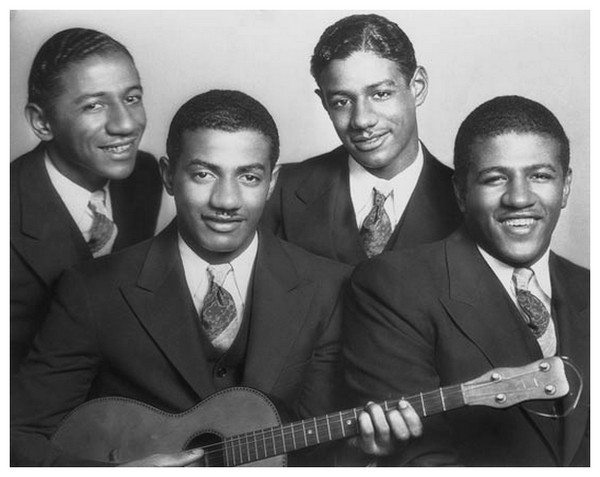

# The Mills Brothers

## Artist Profile

American vocal quartet, among the most unique and influential in the history of both jazz and mainstream popular music.
The four brothers were all born in Piqua, Ohio, United States - John Charles (born Oct. 19, 1910, died Jan. 24, 1936, Bellefontaine, Ohio), Herbert (born April 2, 1912, died April 12, 1989, Las Vegas, Nev.), Harry (born Aug. 19, 1913, died June 28, 1982, Los Angeles, Calif.), and Donald (born April 29, 1915, died Nov. 13, 1999, Los Angeles).
After moving to New York, the group became a sensation and hit it big during 1931 and early 1932 with their versions of "Tiger Rag" and "Dinah".
During the years 1933-1935, the Brothers starred with Crosby for Woodbury Soap in Bing Crosby Entertains, making 27 appearances in all on the CBS radio show. They also recorded their classics "Lazy Bones", "Sweet Sue", "Lulu's Back In Town", "Bye-Bye Blackbird", "Sleepy Head", and "Shoe Shine Boy". Their film appearances included Twenty Million Sweethearts (Warner Brothers, 1934) and Broadway Gondolier (Warner Brothers, 1935).
Through 1939 the group enjoyed remarkable success in Europe. During the Second World War, there was also a brief time when the group performed with a non family singer. Gene Smith served as a stand-in for one year when the Army drafted Harry. Although Smith's solo singing did not particularly resemble the group's usual sound, he was able to harmonize well until the fourth brother's return. Smith is noticeable in a number of the Mills Brothers' film appearances.
The rise of rock and roll in the early fifties did little to decrease the Mills Brothers popularity. In 1957, John Sr., aged 68, stopped touring with the group. As a trio, the Mills Brothers were frequent guests on numerous television programs. The Mills Brothers' celebrated their fiftieth anniversary in show business in 1976.

## Artist Links

- [https://www.themillsbrothers.com/](https://www.themillsbrothers.com/)
- [https://en.wikipedia.org/wiki/The_Mills_Brothers](https://en.wikipedia.org/wiki/The_Mills_Brothers)
- [https://www.singers.com/group/Mills-Brothers/](https://www.singers.com/group/Mills-Brothers/)
- [https://adp.library.ucsb.edu/index.php/mastertalent/detail/103495/Mills_Brothers](https://adp.library.ucsb.edu/index.php/mastertalent/detail/103495/Mills_Brothers)
- [https://www.scaruffi.com/vol1/mills.html](https://www.scaruffi.com/vol1/mills.html)

## See also

- [I Had To Call You Up To Say I'm Sorry](I_Had_To_Call_You_Up_To_Say_Im_Sorry.md)
