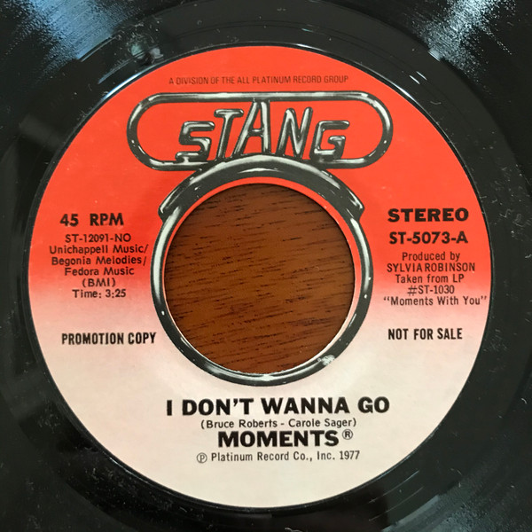

# I Don't Wanna Go

By The Moments

## Album Data

[Discogs URL](https://www.discogs.com/release/4610871-The-Moments-I-Dont-Wanna-Go)

- Label: Stang Records
- Formats: Vinyl, 7", 45 RPM
- Genres: Funk / Soul, Soul
- Rating: 4.67
- Released: 1977
- Year: 1977
- Release ID: 4610871
- Media condition: 
- Sleeve condition: 
- Speed: 
- Weight: 
- Notes: 

## Album Tracks

| **Position** | **Title** | **Duration** |
|--------------|-----------|--------------|
| A | **I Don't Wanna Go** | 3:25 |
| B | **Oh I Could Have Loved You** | 4:28 |

## Artist Roles

| **Name** | **Role** |
|----------|----------|
| **Sylvia Robinson** | Producer |

