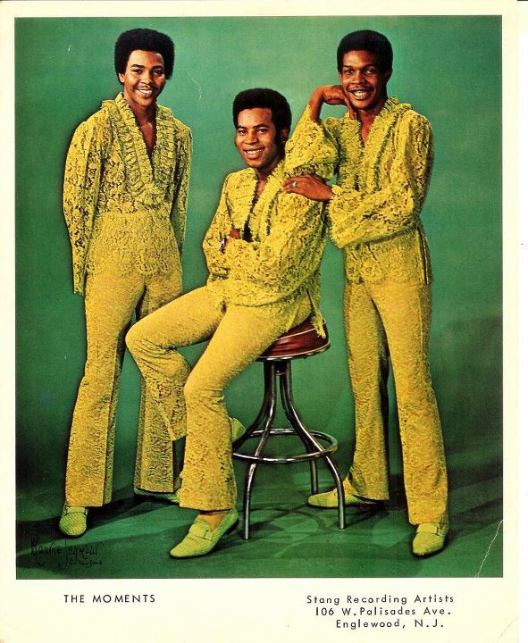

# The Moments

## Artist Profile

Soul vocal trio.

Formed in Washington in the mid-'60s. Larry Mizell &amp; Fonce Mizell with Freddie Perren signed them at Hog (2). Sylvia Robinson then signed them at Stang Records. After the initial changing line ups they started having hits as the trio that later in the late '70s evolved to Ray, Goodman &amp; Brown.
Al Goodman b. 31/03/1947, Jackson, Mississippi, U.S.A.
William Brown b. 30/06/1946, Perth Amboy, New Jersey, U.S.A.
Harry Ray b. 15/12/1946, Long Branch, New Jersey, U.S.A. 
d. 01/10/1992

## Artist Links

- [https://www.whosampled.com/The-Moments/](https://www.whosampled.com/The-Moments/)

## See also

- [I Don't Wanna Go](I_Dont_Wanna_Go.md)
