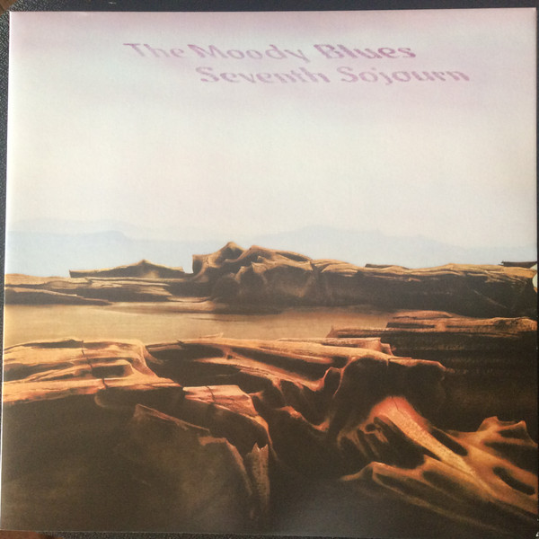

# Seventh Sojourn

By The Moody Blues

## Album Data

[Discogs URL](https://www.discogs.com/release/9697155-The-Moody-Blues-Seventh-Sojourn)

- Label: Friday Music
- Formats: Vinyl, LP, Album, Reissue, Remastered, Stereo
- Genres: Rock, Psychedelic Rock
- Rating: 4.46
- Released: 2015-09-15
- Year: 1972
- Release ID: 9697155
- Media condition: 
- Sleeve condition: 
- Speed: 
- Weight: 
- Notes: 

## Album Tracks

| **Position** | **Title** | **Duration** |
|--------------|-----------|--------------|
| A1 | **Lost In A Lost World** | 4:42 |
| A2 | **New Horizons** | 5:11 |
| A3 | **For My Lady** | 3:58 |
| A4 | **Isn't Life Strange** | 6:09 |
| B1 | **You And Me** | 4:21 |
| B2 | **The Land Of Make-Believe** | 4:52 |
| B3 | **When You're A Free Man** | 6:06 |
| B4 | **I'm Just A Singer (In A Rock And Roll Band)** | 4:18 |

## Artist Roles

| **Name** | **Role** |
|----------|----------|
| **Dave Baker** | Engineer |
| **Tony Clarke** | Producer |
| **Derek Varnals** | Recorded By |

