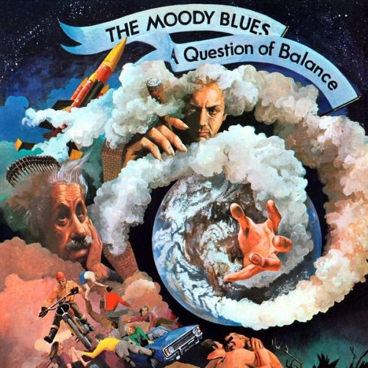

# A Question Of Balance

By The Moody Blues

## Album Data

[Discogs URL](https://www.discogs.com/release/5907158-The-Moody-Blues-A-Question-Of-Balance)

- Label: Friday Music
- Formats: Vinyl, LP, Album, Reissue, Remastered, Stereo
- Genres: Rock, Hard Rock, Psychedelic Rock
- Rating: 4.26
- Released: 2014
- Year: 1970
- Release ID: 5907158
- Media condition: 
- Sleeve condition: 
- Speed: 
- Weight: 
- Notes: 

## Album Tracks

| **Position** | **Title** | **Duration** |
|--------------|-----------|--------------|
| A1 | **Question** |  |
| A2 | **How Is It (We Are Here)** |  |
| A3 | **And The Tide Rushes In** |  |
| A4 | **Don't You Feel Small** |  |
| A5 | **Tortoise And The Hare** |  |
| B1 | **It's Up To You** |  |
| B2 | **Minstrel's Song** |  |
| B3 | **Dawning Is The Day** |  |
| B4 | **Melancholy Man** |  |
| B5 | **The Balance** |  |

## Artist Roles

| **Name** | **Role** |
|----------|----------|
| **Adrian Martins** | Engineer |
| **Derek Varnals** | Engineer |
| **Robin Thompson** | Engineer |
| **The Moody Blues** | Instruments [All Instruments Played By] |
| **Joe Reagoso** | Mastered By |
| **Phil Travers** | Painting [Cover] |
| **David Rohl** | Photography By |
| **David Rohl** | Photography [Montage] |
| **Mike Goss** | Photography [Montage] |
| **Tony Clarke** | Producer |
| **Joe Reagoso** | Reissue Producer |

