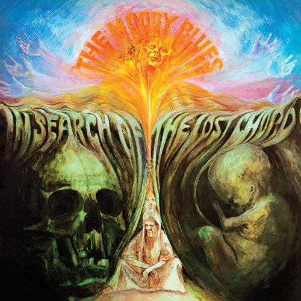

# In Search Of The Lost Chord

By The Moody Blues

## Album Data

[Discogs URL](https://www.discogs.com/release/5767727-The-Moody-Blues-In-Search-Of-The-Lost-Chord)

- Label: Deram
Friday Music
- Formats: Vinyl, LP, Album, Reissue, Stereo
- Genres: Rock, Psychedelic Rock, Symphonic Rock
- Rating: 4.65
- Released: 2014
- Year: 1968
- Release ID: 5767727
- Media condition: 
- Sleeve condition: 
- Speed: 
- Weight: 
- Notes: 

## Album Tracks

| **Position** | **Title** | **Duration** |
|--------------|-----------|--------------|
| A1 | **Departure** |  |
| A2 | **Ride My See-Saw** |  |
| A3 | **Dr. Livingstone, I Presume** |  |
| A4 | **House Of Four Doors** |  |
| A5 | **Legend Of A Mind** |  |
| A6 | **House Of Four Doors (Part Two)** |  |
| B1 | **Voices In The Sky** |  |
| B2 | **The Best Way To Travel** |  |
| B3 | **Visions Of Paradise** |  |
| B4 | **The Actor** |  |
| B5 | **The Word** |  |
| B6 | **Om** |  |

## Artist Roles

| **Name** | **Role** |
|----------|----------|
| **John Lodge** | Bass Guitar, Cello, Tambourine, Snare [Snare Drum], Acoustic Guitar [Accoustic Guitar], Vocals |
| **Ray Thomas** | Concert Flute ['C' Flute], Alto Flute, Soprano Saxophone, Vocals |
| **Phil Travers** | Cover |
| **Graeme Edge** | Drums, Timpani, Tambourine, Tabla [Tablas], Piano |
| **Kevin Gray** | Lacquer Cut By |
| **W (12)** | Mastered By |
| **Mike Pinder** | Mellotron [Mellotrons], Piano, Harpsichord, Cello, Acoustic Guitar [Accoustic Guitar], Bass Guitar, Autoharp |
| **Tony Clarke** | Producer, Sleeve Notes |
| **Justin Hayward** | Twelve-String Guitar, Acoustic Guitar [Accoustic Guitar], Electric Guitar, Sitar, Tabla [Tablas], Piano, Mellotron, Bass Guitar, Harpsichord, Percussion, Vocals |

