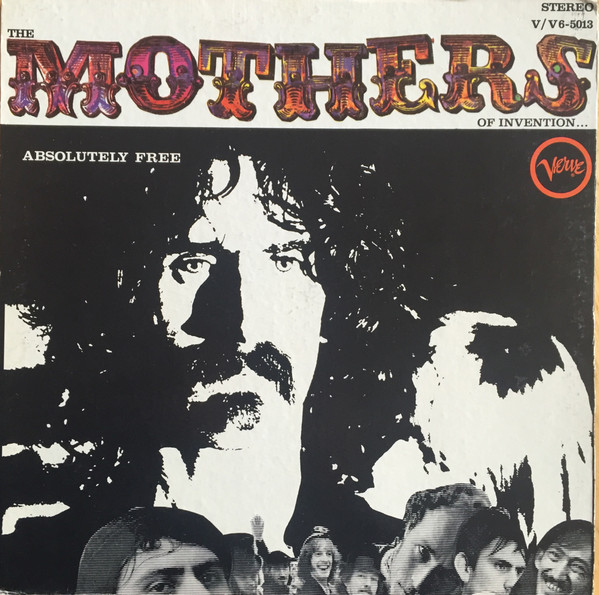

# Absolutely Free

By The Mothers

## Album Data

[Discogs URL](https://www.discogs.com/release/5660085-The-Mothers-Of-Invention-Absolutely-Free)

- Label: Verve Records
Verve Records
Verve Records
- Formats: Vinyl, LP, Album, Reissue, Stereo
- Genres: Rock, Blues Rock, Psychedelic Rock, Avantgarde, Prog Rock
- Rating: 4.29
- Released: 1972
- Year: 1967
- Release ID: 5660085
- Media condition: 
- Sleeve condition: 
- Speed: 
- Weight: 
- Notes: 

## Album Tracks

| **Position** | **Title** | **Duration** |
|--------------|-----------|--------------|
|  | **Absolutely Free** | 19:34 |
| A1 | **Plastic People** | 3:40 |
| A2a | **The Duke Of Prunes** | 2:12 |
| A2b | **Amnesia Vivace** | 1:01 |
| A2c | **The Duke Regains His Chops** | 1:45 |
| A3a | **Call Any Vegetable** | 2:19 |
| A3b | **Invocation & Ritual Dance Of The Young Pumpkin** | 6:57 |
| A3c | **Soft-Sell Conclusion & Ending Of Side #1** | 1:40 |
|  | **The M.O.I. American Pageant** | 18:35 |
| B1 | **America Drinks** | 1:52 |
| B2 | **Status Back Baby** | 2:52 |
| B3 | **Uncle Bernie's Farm** | 2:09 |
| B4 | **Son Of Suzy Creamcheese** | 1:33 |
| B5 | **Brown Shoes Don't Make It** | 7:26 |
| B6 | **America Drinks & Goes Home** | 2:43 |

## Artist Roles

| **Name** | **Role** |
|----------|----------|
| **Frank Zappa** | Composed By, Arranged By, Conductor, Performer |
| **Val Valentin** | Engineer [Director Of Engineering] |
| **David Greene** | Engineer [Remix] |
| **Ami Hadani** | Engineer, Recorded By |
| **Frank Zappa** | Layout, Artwork By [Cover Art, Collages], Liner Notes |
| **Billy Mundi** | Musician |
| **Bunk Gardner** | Musician |
| **Don Preston** | Musician |
| **Jimmy Carl Black** | Musician |
| **Motorhead Sherwood** | Musician |
| **Ray Collins** | Musician |
| **Roy Estrada** | Musician |
| **Alice Ochs** | Photography By [Front] |
| **Jerry Deiter** | Photography By [Other] |
| **Marshal Harmon** | Photography By [Other] |
| **Tom Wilson (2)** | Producer |

