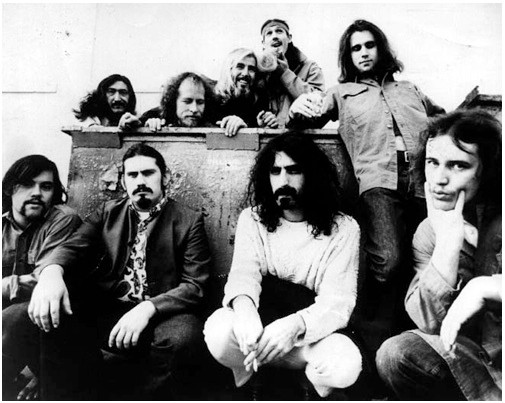

# The Mothers

## Artist Profile

The Mothers or The Mothers Of Invention.
Frank Zappa teamed with gigging R&B group 'The Soul Giants' in 1964. The band included vocalist Ray Collins, bassist Roy Estrada and drummer Jimmy Carl Black. Zappa emerged as their creative leader and the band became 'The Mothers' (as in mother-f**kers = good musicians). After signing to Verve Records this was appended to 'The Mothers Of Invention' at the insistence of the label. Until Zappa founded his own label the appendage was usually added in mock deference and the band were usually referred to as 'The Mothers'.

Guitarist Elliot Ingber then joined and, for much of their seminal 1960's albums, the group also included woodwind player Bunk Gardner, saxophonist Motorhead Sherwood, keyboardist Don Preston, multi-instrumentalist Ian Underwood and additional drummers Billy Mundi and Art Tripp. Most of these artists appeared on "Freak Out!" (1966), "Absolutely Free" and "We're Only In It For The Money" (1967), "Cruising With Ruben & the Jets" (1968) and "Uncle Meat" (1969).
During Zappa's jazz/classical rock period of 1969-1970, his works were augmented by violinists Don &quot;Sugarcane&quot; Harris and Jean-Luc Ponty, percussionist Ruth Underwood and drummers Aynsley Dunbar and John Guerin. Most of these artists appeared on "Uncle Meat", "Hot Rats", "Weasels Ripped My Flesh" and "Burnt Weeny Sandwich". 

From 1970-72, Zappa formed a new line-up with former The Turtles members Flo &amp; Eddie and bassist Jim Pons. Preston, Underwood and Dunbar remained in the line-up, along with additional keyboardist George Duke. This line-up was disbanded, after Zappa was pushed from the stage by a fan in 1972. (He could not tour for the next year). Two more jazz rock albums, "Waka Jawaka" and "The Grand Wazoo", were recorded with much of the previous jazz-rock group including Preston, Ian and Ruth Underwood, Dunbar, Ponty, Huerin and Duke. Trumpeter Sal Marquez was also added. Zappa and the band went back to vocal rock songs with jazz elements in 1973 on "Over-Nite Sensation", then 1974's "Apostrophe" and 1975's "One Size Fits All". Much of the same band remained, along with new members Bruce Lambourne Fowler (trombone), Tom Fowler (bass) and Napoleon M. Brock (saxophone). In 1975 Zappa called a halt to this backing band. By the late '70s an entirely new support band was formed, with only occasional participation from past members, including a re-appearance of Captain Beefheart. Beginning in the 80's, past 'Mothers' members Collins, Black, Gardner, Sherwood, Preston, Tom and Bruce Fowler occasionally played in a mock Zappa band, 'The Grandmothers'. In 1985 Zappa adroitly used 'The Mothers Of Prevention' in his assault on American censorship aspects of the music industry.

Please visit this thread:
https://www.discogs.com/forum/thread/773699?page=1#7674203

## Artist Links

- [http://wiki.killuglyradio.com/wiki/The_Mothers](http://wiki.killuglyradio.com/wiki/The_Mothers)
- [http://en.wikipedia.org/wiki/Mothers_of_invention](http://en.wikipedia.org/wiki/Mothers_of_invention)
- [http://www.zappafrenzy.com/index.html](http://www.zappafrenzy.com/index.html)

## See also

- [Absolutely Free](Absolutely_Free.md)
