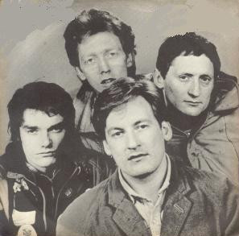

# The Motors

## Artist Profile

UK Punk / New Wave group formed around 1977, they scored a big UK chart hit with 'Airport' in 1978 reaching number 4. The follow up 'Forget About You' narrowly missed repeating the top ten success, the group split up in 1980 after their last song only reached number 58.

## Artist Links

## See also

- [Cold Love](Cold_Love.md)
