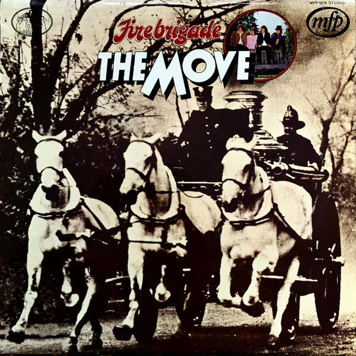

# Fire Brigade

By The Move

## Album Data

[Discogs URL](https://www.discogs.com/release/5519540-The-Move-Fire-Brigade)

- Label: Music For Pleasure
- Formats: Vinyl, LP, Compilation
- Genres: Rock, Pop Rock
- Rating: 3.59
- Released: 1972
- Year: 1972
- Release ID: 5519540
- Media condition: 
- Sleeve condition: 
- Speed: 
- Weight: 
- Notes: 

## Album Tracks

| **Position** | **Title** | **Duration** |
|--------------|-----------|--------------|
| A1 | **Flowers In The Rain** |  |
| A2 | **(Here We Go Round) The Lemon Tree** |  |
| A3 | **Fire Brigade** |  |
| A4 | **Beautiful Daughter** |  |
| A5 | **Wild Tiger Woman** |  |
| A6 | **Blackberry Way** |  |
| B1 | **Curly** |  |
| B2 | **Omnibus** |  |
| B3 | **Walk Upon The Water** |  |
| B4 | **When Alice Comes Back To The Farm** |  |
| B5 | **Yellow Rainbow** |  |
| B6 | **Brontosaurus** |  |

## Artist Roles

| **Name** | **Role** |
|----------|----------|
| **Ian Hunter (4)** | Cover, Design |
| **Rex Features** | Photography By |
| **Roy Wood** | Written-By |

