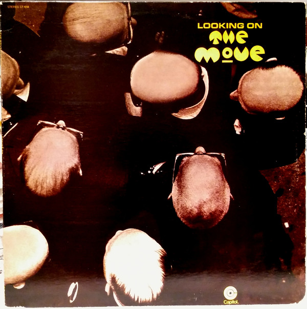

# Looking On

By The Move

## Album Data

[Discogs URL](https://www.discogs.com/release/8538994-The-Move-Looking-On)

- Label: Capitol Records
- Formats: Vinyl, LP, Album, Reissue
- Genres: Rock, Blues Rock, Hard Rock, Prog Rock, Psychedelic Rock
- Rating: 4
- Released: 1971
- Year: 1970
- Release ID: 8538994
- Media condition: 
- Sleeve condition: 
- Speed: 
- Weight: 
- Notes: 

## Album Tracks

| **Position** | **Title** | **Duration** |
|--------------|-----------|--------------|
| A1 | **Looking On** | 7:47 |
| A2 | **Turkish Tram Conductor Blues** | 4:48 |
| A3 | **What?** | 6:45 |
| A4 | **When Alice Comes Back To The Farm** | 3:40 |
| B1 | **Open Up Said The World At The Door** | 7:12 |
| B2 | **Brontosaurus** | 4:30 |
| B3 | **Feel Too Good** | 9:33 |

## Artist Roles

| **Name** | **Role** |
|----------|----------|
| **Jeff Lynne** | Backing Vocals |
| **Roy Wood** | Backing Vocals |
| **Rick Price (4)** | Bass |
| **Graphreaks** | Design |
| **Bev Bevan** | Drums, Percussion |
| **Jeff Lynne** | Drums, Percussion |
| **Roger Wake** | Engineer |
| **Roy Wood** | Oboe, Sitar, Slide Guitar, Cello, Guitar, Bass, Saxophone [All Saxes] |
| **Phil Copestake** | Other [Refreshments] |
| **(The Famous) Upsy** | Percussion [Various Percussive Implements] |
| **Jeff Lynne** | Piano, Guitar |
| **Jeff Lynne** | Producer [Produced By] |
| **Roy Wood** | Producer [Produced By] |
| **Jeff Lynne** | Vocals |
| **Roy Wood** | Vocals |

