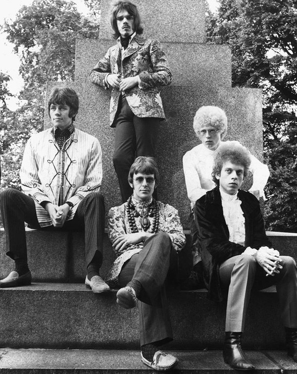

# The Move

## Artist Profile

British rock band from Birmingham formed in 1965 and disbanded in 1972. They formed into ELO (Electric Light Orchestra) after several line-up changes and primary songwriter Roy Woods's desire to form a new band that would play orchestral as well as hard rock. The Move are perhaps best known for their string of top 5 UK chart hits, including their debut "Night of Fear" (#2), "I Can Hear the Grass Grow (#5), Flowers in the Rain (#2), Fire Brigade (#3), and Blackberry Way (#1) all between 1966 and 1968. Despite releasing 4 albums, only their 1968 debut "Move" charted, reaching #15 in the UK. 

## Artist Links

- [https://en.wikipedia.org/wiki/The_Move](https://en.wikipedia.org/wiki/The_Move)
- [https://garagehangover.com/the-move-gigs-1966-1970/](https://garagehangover.com/the-move-gigs-1966-1970/)
- [https://www.imdb.com/name/nm2846046/](https://www.imdb.com/name/nm2846046/)
- [http://www.brumbeat.net/move.htm](http://www.brumbeat.net/move.htm)
- [https://counteract.co/features/beginners-guide-to-the-move/](https://counteract.co/features/beginners-guide-to-the-move/)
- [http://www.progarchives.com/artist.asp?id=3776](http://www.progarchives.com/artist.asp?id=3776)
- [https://www.birminghammail.co.uk/news/local-news/gallery/roy-wood-the-move-years-228796](https://www.birminghammail.co.uk/news/local-news/gallery/roy-wood-the-move-years-228796)
- [https://www.10538overture.dk/MOVE/Fronts/move_history.html](https://www.10538overture.dk/MOVE/Fronts/move_history.html)

## See also

- [Fire Brigade](Fire_Brigade.md)
- [Looking On](Looking_On.md)
