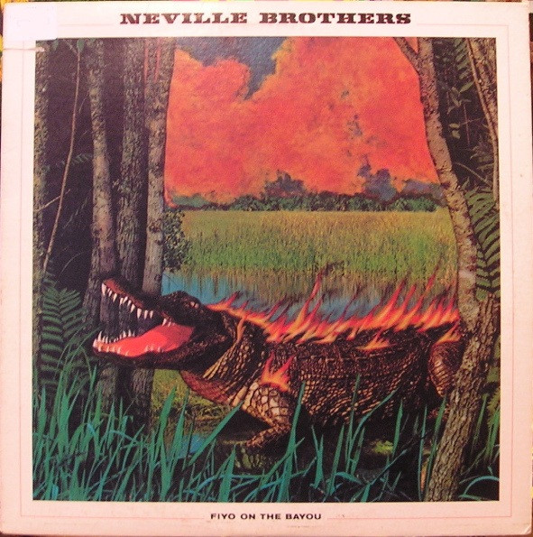

# Fiyo On The Bayou

By The Neville Brothers

## Album Data

[Discogs URL](https://www.discogs.com/release/1637538-The-Neville-Brothers-Fiyo-On-The-Bayou)

- Label: A&M Records
- Formats: Vinyl, LP, Album, Stereo
- Genres: Funk / Soul, Bayou Funk
- Rating: 3.75
- Released: 1981
- Year: 1981
- Release ID: 1637538
- Media condition: 
- Sleeve condition: 
- Speed: 
- Weight: 
- Notes: 

## Album Tracks

| **Position** | **Title** | **Duration** |
|--------------|-----------|--------------|
| A1 | **Hey Pocky Way** | 4:12 |
| A2 | **Sweet Honey Dripper** | 5:18 |
| A3 | **Fire On The Bayou** | 5:17 |
| A4 | **The Ten Commandments Of Love** | 3:43 |
| B1 | **Sitting In Limbo** | 4:10 |
| B2 | **Brother John / Iko Iko** | 5:34 |
| B3 | **Mona Lisa** | 3:44 |
| B4 | **Run Joe** | 3:34 |

## Artist Roles

| **Name** | **Role** |
|----------|----------|
| **Wardell Quezergue** | Arranged By [Horns Arranged By] |
| **Chuck Beeson** | Art Direction |
| **Jeffrey Kent Ayeroff** | Art Direction |
| **David Barard** | Bass |
| **Alfred Brown** | Contractor [String Contractor] |
| **Melanie Nissen** | Design |
| **Eddie Garcia** | Engineer [Assistant Engineer, Atlantic Studios] |
| **Danny Jones (2)** | Engineer [Assistant Engineer, Sea-Saint Studios] |
| **Cornelius Dennis, Jr.** | Engineer [Assistant Engineer, Studio In The Country] |
| **Cosimo V. Matassa** | Engineer [Assistant Engineer, Studio In The Country] |
| **David Farrell** | Engineer [Assistant Engineer, Studio In The Country] |
| **Skip Godwin** | Engineer [Assistant Engineer, Studio In The Country] |
| **Carl Blouin** | Horns [Horn Section], Baritone Saxophone |
| **Amadee Castenell** | Horns [Horn Section], Saxophone |
| **Jim Duggan** | Horns [Horn Section], Trombone |
| **Jim Weber (2)** | Horns [Horn Section], Trumpet |
| **Joe Foxx** | Horns [Horn Section], Trumpet |
| **Lou Beach** | Illustration [Front Cover Illustration] |
| **Pearl Beach** | Illustration [Front Cover Illustration] |
| **George Piros** | Lacquer Cut By |
| **Bill Johnston (3)** | Management [Management And Direction] |
| **George Piros** | Mastered By |
| **David Gahr** | Photography By [Photo Of Aaron, Art & Cyril Neville] |
| **Jeanette Korad** | Photography By [Photo Of Charles Neville] |
| **Syndey Byrd** | Photography By [Photo Of George "Big Chief Jolly" Landry] |
| **Joel Dorn** | Producer |
| **Hal Willner** | Production Manager [Production Associate] |
| **Gene Paul** | Recorded By, Mixed By [Re-mixed By] |
| **Herman Ernest III** | Rhythm Section, Drums |
| **Leo Nocentelli** | Rhythm Section, Guitar |
| **Art Neville** | Rhythm Section, Keyboards |
| **David "Fathead" Newman** | Soloist, Tenor Saxophone [All Tenor Saxophone Solos] |

