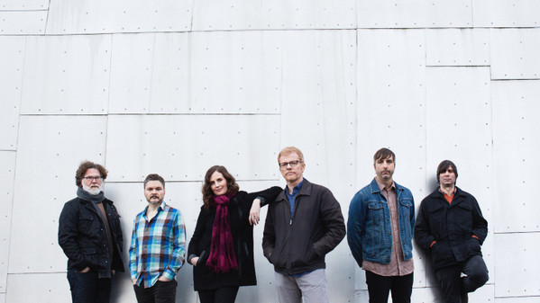

# The New Pornographers

## Artist Profile

The New Pornographers is a Canadian indie rock band formed in 1997 in Vancouver, British Columbia. Presented as a musical collective of singer-songwriters and musicians from multiple projects, the band has released eight studio albums to critical acclaim for their use of multiple vocalists and elements of power pop incorporated into their music.

## Artist Links

- [http://www.thenewpornographers.com/](http://www.thenewpornographers.com/)
- [https://en.wikipedia.org/wiki/The_New_Pornographers](https://en.wikipedia.org/wiki/The_New_Pornographers)
- [https://www.facebook.com/thenewpornographers](https://www.facebook.com/thenewpornographers)
- [https://twitter.com/thenewpornos](https://twitter.com/thenewpornos)
- [https://genius.com/artists/The-new-pornographers](https://genius.com/artists/The-new-pornographers)

## See also

- [Brill Bruisers](Brill_Bruisers.md)
- [Whiteout Conditions](Whiteout_Conditions.md)
