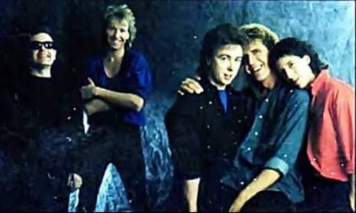

# The Outfield

## Artist Profile

The Outfield were an English rock band based in London, England. The band achieved success in the mid-1980s and are best remembered for their hit single, "Your Love". The band's lineup at that time was guitarist John Spinks, vocalist and bassist Tony Lewis, and drummer Alan Jackman.

They enjoyed most commercial success in the US. Their first album, Play Deep, reached No. 9 on the Billboard 200 in 1985 and was certified triple platinum in the United States. The single "Your Love" reached No. 6 on the Billboard Hot 100 and No. 7 on the Mainstream Rock chart. The band continued to record and tour through the 1980s and then into the early 1990s. While subsequent albums Bangin' (1987) and Voices of Babylon (1989) saw some chart successes, the group's popularity waned.

Drummer Alan Jackman left and, as a duo, they recorded Diamond Days in 1991. After the disappointing response to their 1992 album Rockeye, which represented a shift towards progressive rock and arena rock, the group disbanded. They resumed touring in 1998, and released two live albums via their website, along with a new studio album, Any Time Now in 2004, which was later re-released in 2006. In 2011, the band released their final album, Replay, with original drummer Alan Jackman re-joining the band. Spinks died in 2014 after which the group officially disbanded.

## Artist Links

- [http://www.theoutfield.com/](http://www.theoutfield.com/)
- [https://en.wikipedia.org/wiki/The_Outfield](https://en.wikipedia.org/wiki/The_Outfield)
- [http://www.45cat.com/artist/the-outfield](http://www.45cat.com/artist/the-outfield)

## See also

- [Your Love](Your_Love.md)
