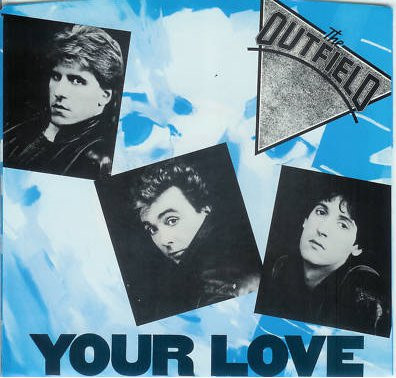

# Your Love

By The Outfield

## Album Data

[Discogs URL](https://www.discogs.com/release/2288166-The-Outfield-Your-Love)

- Label: Columbia
- Formats: Vinyl, 7", 45 RPM, Styrene
- Genres: Rock, Pop Rock
- Rating: 4.29
- Released: 1985
- Year: 1986
- Release ID: 2288166
- Media condition: 
- Sleeve condition: 
- Speed: 
- Weight: 
- Notes: 

## Album Tracks

| **Position** | **Title** | **Duration** |
|--------------|-----------|--------------|
| A | **Your Love** | 3:22 |
| B | **61 Seconds** | 4:18 |

## Artist Roles

| **Name** | **Role** |
|----------|----------|
| **William Wittman** | Producer |
| **John Spinks** | Written-By |

