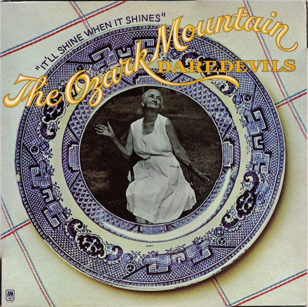

# It'll Shine When It Shines

By The Ozark Mountain Daredevils

## Album Data

[Discogs URL](https://www.discogs.com/release/2297434-The-Ozark-Mountain-Daredevils-Itll-Shine-When-It-Shines)

- Label: A&M Records
- Formats: Vinyl, LP, Album
- Genres: Rock, Country Rock, Southern Rock, Pop Rock
- Rating: 3.76
- Released: 1974
- Year: 1974
- Release ID: 2297434
- Media condition: 
- Sleeve condition: 
- Speed: 
- Weight: 
- Notes: 

## Album Tracks

| **Position** | **Title** | **Duration** |
|--------------|-----------|--------------|
| A1 | **You Made It Right** | 3:48 |
| A2 | **Look Away** | 3:35 |
| A3 | **Jackie Blue** | 4:10 |
| A4 | **Kansas You Fooler** | 2:37 |
| A5 | **It Couldn't Be Better** | 4:23 |
| A6 | **E.E. Lawson** | 3:33 |
| B1 | **Walkin' Down The Road** | 3:26 |
| B2 | **What's Happened Along In My Life** | 3:34 |
| B3 | **It Probably Always Will** | 3:12 |
| B4 | **Lowlands** | 3:48 |
| B5 | **Tidal Wave** | 4:10 |
| B6 | **It'll Shine When It Shines** | 3:37 |

## Artist Roles

| **Name** | **Role** |
|----------|----------|
| **Nick DeCaro** | Accordion |
| **Roland Young (3)** | Art Direction |
| **Jody Troutman** | Backing Vocals |
| **Glyn Johns** | Engineer |
| **Beverly Parker (2)** | Graphics |
| **Glyn Johns** | Guitar [High String] |
| **Doug Sax** | Mastered By |
| **Buddy Brayfield** | Performer [The Ozark Mountain Daredevils] |
| **John Dillon (3)** | Performer [The Ozark Mountain Daredevils] |
| **Larry Lee (3)** | Performer [The Ozark Mountain Daredevils] |
| **Michael Granda** | Performer [The Ozark Mountain Daredevils] |
| **Randle Chowning** | Performer [The Ozark Mountain Daredevils] |
| **Steve Cash** | Performer [The Ozark Mountain Daredevils] |
| **Harry Mittman** | Photography By |
| **Jim Mayfield (2)** | Photography By [Black And White] |
| **David Anderle** | Producer |
| **Glyn Johns** | Producer |

