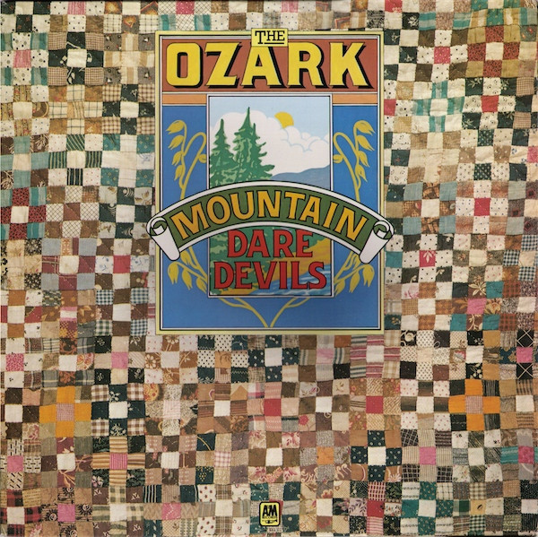

# The Ozark Mountain Daredevils

By The Ozark Mountain Daredevils

## Album Data

[Discogs URL](https://www.discogs.com/release/990950-The-Ozark-Mountain-Daredevils-The-Ozark-Mountain-Daredevils)

- Label: A&M Records
A&M Records
- Formats: Vinyl, LP, Album
- Genres: Rock, Country Rock, Southern Rock
- Rating: 3.75
- Released: 1973
- Year: 1973
- Release ID: 990950
- Media condition: 
- Sleeve condition: 
- Speed: 
- Weight: 
- Notes: 

## Album Tracks

| **Position** | **Title** | **Duration** |
|--------------|-----------|--------------|
| A1 | **Country Girl** | 3:14 |
| A2 | **Spaceship Orion** | 3:10 |
| A3 | **If You Wanna Get To Heaven** | 3:04 |
| A4 | **Chicken Train** | 3:36 |
| A5 | **Colorado Song** | 5:06 |
| B1 | **Standing On The Rock** | 3:54 |
| B2 | **Road To Glory** | 4:54 |
| B3 | **Black Sky** | 3:05 |
| B4 | **Within Without** | 4:25 |
| B5 | **Beauty In The River** | 3:53 |

## Artist Roles

| **Name** | **Role** |
|----------|----------|
| **John Dillon (3)** | Acoustic Guitar |
| **Larry Lee (3)** | Acoustic Guitar |
| **Randle Chowning** | Acoustic Guitar |
| **Mike Doud (2)** | Art Direction |
| **John Dillon (3)** | Autoharp |
| **Michael Granda** | Bass |
| **Mike Dempsey (2)** | Design |
| **Larry Lee (3)** | Drums |
| **John Dillon (3)** | Dulcimer |
| **John Dillon (3)** | Electric Guitar |
| **John Dillon (3)** | Fiddle |
| **Randle Chowning** | Harmonica [Harp] |
| **Steve Cash** | Harmonica [Harp] |
| **Buddy Brayfield** | Harpsichord |
| **John Dillon (3)** | Jew's Harp [Mouthbow] |
| **Randle Chowning** | Lead Guitar [Electric] |
| **John Dillon (3)** | Mandolin |
| **Buddy Brayfield** | Organ |
| **Buddy Brayfield** | Percussion |
| **John Dillon (3)** | Percussion |
| **Larry Lee (3)** | Percussion |
| **Michael Granda** | Percussion |
| **Steve Cash** | Percussion |
| **Bill Higgins** | Photography By |
| **Kansas Film Works** | Photography By |
| **Jeremy Parkin** | Photography By [Sleeve] |
| **Buddy Brayfield** | Piano |
| **David Anderle** | Producer |
| **Glyn Johns** | Producer |
| **Randle Chowning** | Resonator Guitar [National Steel] |
| **Larry Lee (3)** | Saw |
| **Michael Granda** | Sounds [Chicken Squawks] |
| **Buddy Brayfield** | Vocals |
| **John Dillon (3)** | Vocals |
| **Larry Lee (3)** | Vocals |
| **Michael Granda** | Vocals |
| **Randle Chowning** | Vocals |
| **Steve Cash** | Vocals |

