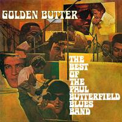

# Golden Butter / The Best Of The Paul Butterfield Blues Band

By The Paul Butterfield Blues Band

## Album Data

[Discogs URL](https://www.discogs.com/release/7640015-The-Paul-Butterfield-Blues-Band-Golden-Butter-The-Best-Of-The-Paul-Butterfield-Blues-Band)

- Label: Friday Music
Elektra
- Formats: Vinyl, LP, Compilation, Reissue, Remastered
- Genres: Rock, Blues, Blues Rock
- Rating: 3.67
- Released: 2013-10-29
- Year: 1972
- Release ID: 7640015
- Media condition: 
- Sleeve condition: 
- Speed: 
- Weight: 
- Notes: 

## Album Tracks

| **Position** | **Title** | **Duration** |
|--------------|-----------|--------------|
| A1 | **Born In Chicago** | 3:07 |
| A2 | **Shake Your Money-Maker** | 2:25 |
| A3 | **Mellow Down Easy** | 2:49 |
| A4 | **Our Love Is Drifting** | 3:33 |
| A5 | **Mystery Train** | 2:35 |
| A6 | **Look Over Yonders Wall** | 2:26 |
| B1 | **East-West** | 13:10 |
| B2 | **Walkin' Blues** | 3:07 |
| B3 | **Get Out Of My Life, Woman** | 3:12 |
| B4 | **Mary, Mary** | 2:50 |
| C1 | **Spoonful** | 2:55 |
| C2 | **One More Mile** | 3:29 |
| C3 | **One More Heartache** | 3:36 |
| C4 | **Last Hope's Gone** | 4:49 |
| C5 | **In My Own Dream** | 5:46 |
| D1 | **Love March** | 2:56 |
| D2 | **Driftin' And Driftin'** | 13:44 |
| D3 | **Blind Leading The Blind** | 4:00 |

## Artist Roles

| **Name** | **Role** |
|----------|----------|
| **Robert L. Heimall** | Art Direction |
| **Barron Storey** | Artwork [Cover Art] |
| **Robert W. Zachary Jr.** | Assemblage, Edited By |
| **Trevor Lawrence** | Baritone Saxophone |
| **Fred Beckmeier** | Bass |
| **Jerome Arnold** | Bass |
| **Rod Hicks** | Bass, Cello, Vocals |
| **Bugsy Maugh** | Bass, Vocals |
| **Big Black (2)** | Congas |
| **Bobbye Hall** | Congas, Bongos |
| **Jo Ann Gruber** | Design |
| **Billy Davenport** | Drums |
| **Dennis Whitted** | Drums |
| **George Davidson** | Drums |
| **Sam Lay** | Drums |
| **Phillip Wilson** | Drums, Congas, Percussion, Vocals [Vocal] |
| **Bruce Botnick** | Engineer |
| **Edison Youngblood** | Engineer |
| **Fritz Richmond** | Engineer |
| **Joe Zagarino** | Engineer |
| **Marc Harmon** | Engineer |
| **Mark Abramson** | Engineer |
| **Paul A. Rothchild** | Engineer |
| **Ray Thompson** | Engineer |
| **Todd Rundgren** | Engineer |
| **Mark Abramson** | Engineer [with the assistance of] |
| **Buzzy Feiten** | Guitar, Piano, Organ |
| **Ralph Wash** | Guitar, Vocals |
| **Paul Butterfield** | Harmonica, Guitar, Flute, Piano, Vocals |
| **Ron McMaster** | Lacquer Cut By |
| **Tony Glover** | Liner Notes |
| **Joe Reagoso** | Mastered By |
| **Mark Naftalin** | Organ, Piano, Keyboards |
| **Mark Naftalin** | Organ, Piano, Keyboards |
| **Daniel R. Rubin** | Photography By |
| **Jerry Ragovoy** | Piano |
| **Teddy Harris** | Piano, Keyboards |
| **Jerry Ragovoy** | Producer |
| **John Court** | Producer |
| **Mark Abramson** | Producer |
| **Paul A. Rothchild** | Producer |
| **Todd Rundgren** | Producer |
| **Mark Abramson** | Producer [with the assistance of] |
| **Elvin Bishop** | Rhythm Guitar, Guitar |
| **Mike Bloomfield** | Slide Guitar, Guitar |
| **David Sanborn** | Soprano Saxophone, Alto Saxophone, Baritone Saxophone |
| **Jac Holzman** | Supervised By [Production] |
| **Gene Dinwiddie** | Tenor Saxophone, Flute, Tambourine, Mandolin |
| **Steve Madaio** | Trumpet |
| **Keith Johnson** | Trumpet, Piano |

