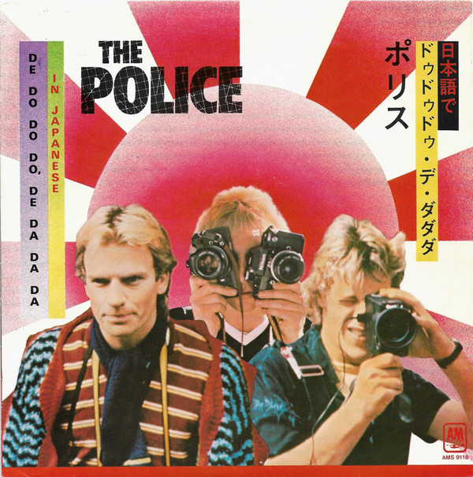

# De Do Do Do, De Da Da Da (In Japanese)

By The Police

## Album Data

[Discogs URL](https://www.discogs.com/release/4371521-The-Police-De-Do-Do-Do-De-Da-Da-Da-In-Japanese)

- Label: A&M Records
A&M Records
- Formats: Vinyl, 7", 45 RPM, Single
- Genres: Rock, Pop Rock
- Rating: 4
- Released: 1981
- Year: 1980
- Release ID: 4371521
- Media condition: 
- Sleeve condition: 
- Speed: 
- Weight: 
- Notes: 

## Album Tracks

| **Position** | **Title** | **Duration** |
|--------------|-----------|--------------|
| A | **De Do Do Do, De Da Da Da (Spanish Version)** | 4:00 |
| B | **De Do Do Do, De Da Da Da (Japanese Version)** | 4:00 |

## Artist Roles

| **Name** | **Role** |
|----------|----------|
| **Nigel Gray** | Producer |
| **The Police** | Producer |
| **Sting** | Written-By |

