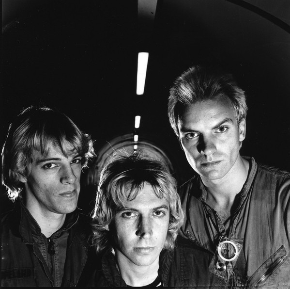

# The Police

## Artist Profile

British rock band from London, England, UK. Active between 1977 to 1984, 1986 and again in 2007 to 2008. Inducted into the Rock And Roll Hall Of Fame in 2003 (Performer).
They played their first ever gig in March 1977 at The Stowaway, Newport, Wales. The classic Police trio debuted on August 18, 1977 at Rebecca's. Their final public performance was on June 11, 1986 in Atlanta, GA, USA, at the climax of Amnesty International's all-star American tour where they played five songs.

## Artist Links

- [https://www.thepolice.com/](https://www.thepolice.com/)
- [https://twitter.com/thepoliceband](https://twitter.com/thepoliceband)
- [https://www.facebook.com/thepolice](https://www.facebook.com/thepolice)
- [https://www.instagram.com/thepolicebandofficial/](https://www.instagram.com/thepolicebandofficial/)
- [https://www.youtube.com/channel/UCuCY8MR9LcAGIXetnKx5SnQ](https://www.youtube.com/channel/UCuCY8MR9LcAGIXetnKx5SnQ)
- [https://www.thepolicetour.com/](https://www.thepolicetour.com/)
- [https://en.wikipedia.org/wiki/The_Police](https://en.wikipedia.org/wiki/The_Police)
- [http://www.thepolicewiki.org/](http://www.thepolicewiki.org/)
- [https://www.onamrecords.com/artists/police](https://www.onamrecords.com/artists/police)

## See also

- [De Do Do Do, De Da Da Da (In Japanese)](De_Do_Do_Do__De_Da_Da_Da_In_Japanese.md)
