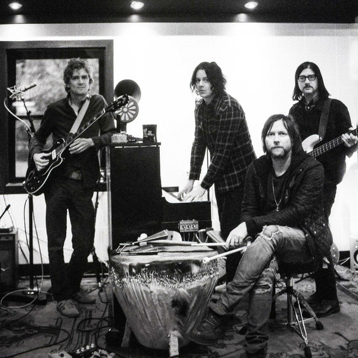

# The Raconteurs

## Artist Profile

Brendan Benson - Guitar, vocals, keyboards
Patrick Keeler - Drums
Jack Lawrence - Bass
Jack White - Guitar, vocals, keyboards

The Raconteurs are also known as The Saboteurs. There is already an Australian group called "The Raconteurs". After lawyers for Jack White's Raconteurs were unsuccessful in buying the name from the Australian group, subsequent Australian releases were rebadged as The Saboteurs.

## Artist Links

- [https://theraconteurs.bandcamp.com](https://theraconteurs.bandcamp.com)
- [http://www.theraconteurs.com](http://www.theraconteurs.com)
- [http://www.thesaboteurs.com](http://www.thesaboteurs.com)
- [https://www.facebook.com/theraconteurs](https://www.facebook.com/theraconteurs)
- [http://www.myspace.com/theraconteurs](http://www.myspace.com/theraconteurs)
- [http://www.youtube.com/user/theraconteurs](http://www.youtube.com/user/theraconteurs)
- [https://www.nugs.net/the-raconteurs-concerts-live-downloads-in-mp3-flac-or-online-music-streaming/?srule=oldest&start=0&sz=12](https://www.nugs.net/the-raconteurs-concerts-live-downloads-in-mp3-flac-or-online-music-streaming/?srule=oldest&start=0&sz=12)
- [https://en.wikipedia.org/wiki/The_Raconteurs](https://en.wikipedia.org/wiki/The_Raconteurs)

## See also

- [Broken Boy Soldiers](Broken_Boy_Soldiers.md)
- [Consolers Of The Lonely](Consolers_Of_The_Lonely.md)
