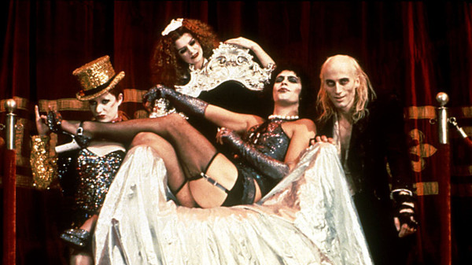

# "The Rocky Horror Picture Show" Original Cast

## Artist Profile

Cast of The Rocky Horror Picture Show, a 1975 musical horror comedy film by 20th Century Fox, produced by Lou Adler and Michael White (18) and directed by Jim Sharman. The screenplay was written by Sharman and actor Richard O'Brien, who was also a member of the cast. The film is based on the 1973 musical stage production The Rocky Horror Show, with music, book, and lyrics by O'Brien.

## Artist Links

- [https://en.wikipedia.org/wiki/The_Rocky_Horror_Picture_Show](https://en.wikipedia.org/wiki/The_Rocky_Horror_Picture_Show)
- [https://www.imdb.com/title/tt0073629/](https://www.imdb.com/title/tt0073629/)

## See also

- [The Rocky Horror Picture Show](The_Rocky_Horror_Picture_Show.md)
