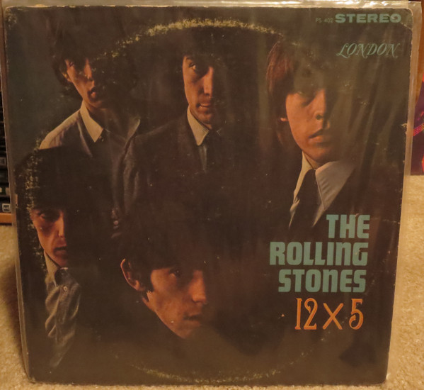

# 12 x 5

By The Rolling Stones

## Album Data

[Discogs URL](https://www.discogs.com/release/7079418-The-Rolling-Stones-12-x-5)

- Label: London Records
London Records
- Formats: Vinyl, LP, Album, Repress
- Genres: Rock, Blues, Pop, Blues Rock, Rock & Roll, Rhythm & Blues
- Rating: 3.64
- Released: null
- Year: 1964
- Release ID: 7079418
- Media condition: 
- Sleeve condition: 
- Speed: 
- Weight: 
- Notes: 

## Album Tracks

| **Position** | **Title** | **Duration** |
|--------------|-----------|--------------|
| A1 | **Around And Around** |  |
| A2 | **Confessin' The Blues** |  |
| A3 | **Empty Heart** |  |
| A4 | **Time Is On My Side** |  |
| A5 | **Good Times, Bad Times** |  |
| A6 | **It's All Over Now** |  |
| B1 | **2120 South Michigan Avenue** |  |
| B2 | **Under The Boardwalk** |  |
| B3 | **Congradulations** |  |
| B4 | **Grown Up Wrong** |  |
| B5 | **If You Need Me** |  |
| B6 | **Suzy Q** |  |

## Artist Roles

| **Name** | **Role** |
|----------|----------|
| **Irv Diehl** | Lacquer Cut By |

