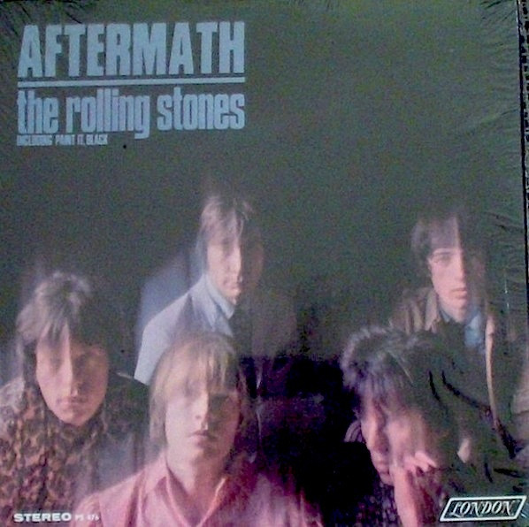

# Aftermath

By The Rolling Stones

## Album Data

[Discogs URL](https://www.discogs.com/release/765072-The-Rolling-Stones-Aftermath)

- Label: London Records
- Formats: Vinyl, LP, Album, Stereo
- Genres: Rock, Pop, Vocal
- Rating: 4.31
- Released: 1966-04-15
- Year: 1966
- Release ID: 765072
- Media condition: 
- Sleeve condition: 
- Speed: 
- Weight: 
- Notes: 

## Album Tracks

| **Position** | **Title** | **Duration** |
|--------------|-----------|--------------|
| A1 | **Paint It Black** | 3:20 |
| A2 | **Stupid Girl** | 2:52 |
| A3 | **Lady Jane** | 3:06 |
| A4 | **Under My Thumb** | 3:20 |
| A5 | **Doncha Bother Me** | 2:35 |
| A6 | **Think** | 3:10 |
| B1 | **Flight 505** | 3:25 |
| B2 | **High And Dry** | 3:06 |
| B3 | **It's Not Easy** | 2:52 |
| B4 | **I Am Waiting** | 3:10 |
| B5 | **Going Home** | 11:35 |

## Artist Roles

| **Name** | **Role** |
|----------|----------|
| **Bill Wyman** | Bass, Marimba, Bells, Piano, Organ, Harpsichord |
| **Charlie Watts** | Drums, Marimba, Bells |
| **Dave Hassinger** | Engineer |
| **Brian Jones (5)** | Guitar, Dulcimer, Sitar, Marimba, Bells, Piano, Organ, Harpsichord |
| **Keith Richards** | Guitar, Vocals |
| **Ian Stewart** | Piano, Organ, Harpsichord |
| **Jack Nitzsche** | Piano, Organ, Harpsichord |
| **Andrew Loog Oldham** | Producer |
| **Jagger-Richards** | Songwriter [Songs By] |
| **Mick Jagger** | Vocals |

