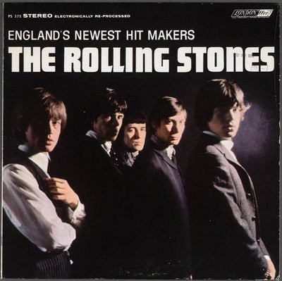

# England's Newest Hit Makers

By The Rolling Stones

## Album Data

[Discogs URL](https://www.discogs.com/release/1906826-The-Rolling-Stones-Englands-Newest-Hit-Makers)

- Label: London Records
- Formats: Vinyl, LP, Album
- Genres: Rock, Pop, Rock & Roll, Pop Rock
- Rating: 4.25
- Released: 1964
- Year: 1964
- Release ID: 1906826
- Media condition: 
- Sleeve condition: 
- Speed: 
- Weight: 
- Notes: 

## Album Tracks

| **Position** | **Title** | **Duration** |
|--------------|-----------|--------------|
| A1 | **Not Fade Away** | 1:48 |
| A2 | **Route 66** | 2:20 |
| A3 | **I Just Want To Make Love To You** | 2:15 |
| A4 | **Honest I Do** | 2:07 |
| A5 | **Now I've Got A Witness** | 2:28 |
| A6 | **Little By Little** | 2:35 |
| B1 | **I'm A King Bee** | 2:33 |
| B2 | **Carol** | 2:35 |
| B3 | **Tell Me** | 3:47 |
| B4 | **Can I Get A Witness** | 3:00 |
| B5 | **You Can Make It If You Try** | 2:10 |
| B6 | **Walking The Dog** | 3:10 |

## Artist Roles

| **Name** | **Role** |
|----------|----------|
| **The Rolling Stones** | Arranged By |
| **Nicholas Wright (2)** | Photography By |
| **Andrew Loog Oldham** | Producer |
| **Eric Easton** | Producer |

