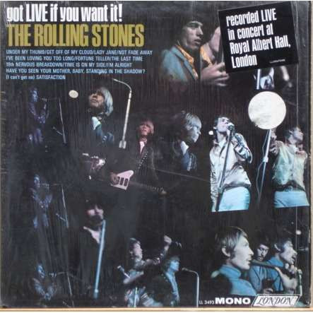

# Got Live If You Want It!

By The Rolling Stones

## Album Data

[Discogs URL](https://www.discogs.com/release/4450168-The-Rolling-Stones-Got-Live-If-You-Want-It)

- Label: London Records
- Formats: Vinyl, LP, Mono, Album
- Genres: Rock, Pop Rock, Blues Rock, Rhythm & Blues, Psychedelic Rock
- Rating: 3.53
- Released: 1966-12-10
- Year: 1966
- Release ID: 4450168
- Media condition: 
- Sleeve condition: 
- Speed: 
- Weight: 
- Notes: 

## Album Tracks

| **Position** | **Title** | **Duration** |
|--------------|-----------|--------------|
| A1 | **Under My Thumb** | 2:45 |
| A2 | **Get Off Of My Cloud** | 2:40 |
| A3 | **Lady Jane** | 3:00 |
| A4 | **Not Fade Away** | 1:55 |
| A5 | **I've Been Loving You Too Long** | 2:50 |
| A6 | **Fortune Teller** | 2:10 |
| B1 | **The Last Time** | 3:00 |
| B2 | **19th Nervous Breakdown** | 3:18 |
| B3 | **Time Is On My Side** | 2:40 |
| B4 | **I'm Alright** | 2:20 |
| B5 | **Have You Seen Your Mother, Baby, Standing In The Shadow?** | 2:50 |
| B6 | **(I Can't Get No) Satisfaction** | 3:45 |

## Artist Roles

| **Name** | **Role** |
|----------|----------|
| **Stephen Inglis** | Design [Cover] |
| **Glyn Johns** | Engineer |
| **Gered Mankowitz** | Photography By |
| **Andrew Loog Oldham** | Producer |

