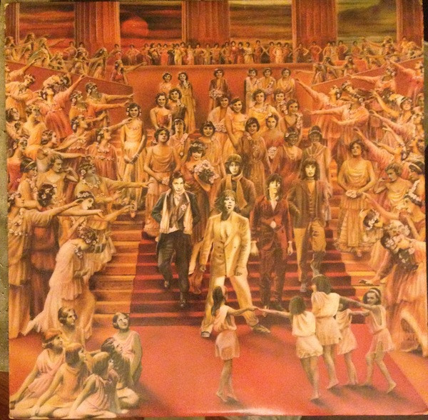

# It's Only Rock 'N Roll

By The Rolling Stones

## Album Data

[Discogs URL](https://www.discogs.com/release/5642260-The-Rolling-Stones-Its-Only-Rock-N-Roll)

- Label: Rolling Stones Records
- Formats: Vinyl, LP, Album
- Genres: Rock, Rock & Roll, Classic Rock
- Rating: 3.85
- Released: 1974
- Year: 1974
- Release ID: 5642260
- Media condition: 
- Sleeve condition: 
- Speed: 
- Weight: 
- Notes: 

## Album Tracks

| **Position** | **Title** | **Duration** |
|--------------|-----------|--------------|
| A1 | **If You Can't Rock Me** | 3:47 |
| A2 | **Ain't Too Proud To Beg** | 3:32 |
| A3 | **It's Only Rock 'N Roll (But I Like It)** | 5:08 |
| A4 | **Till The Next Goodbye** | 4:39 |
| A5 | **Time Waits For No One** | 6:31 |
| B1 | **Luxury** | 4:30 |
| B2 | **Dance Little Sister** | 4:12 |
| B3 | **If You Really Want To Be My Friend** | 6:17 |
| B4 | **Short And Curlies** | 2:44 |
| B5 | **Fingerprint File** | 6:41 |

## Artist Roles

| **Name** | **Role** |
|----------|----------|
| **Blue Magic** | Backing Vocals |
| **Bill Wyman** | Bass Guitar, Synthesizer |
| **Ed Leach** | Cowbell |
| **Guy Peellaert** | Design, Painting |
| **Charlie Watts** | Drums |
| **Howard Kilgour** | Engineer [Assistant] |
| **Mack (2)** | Engineer [Assistant] |
| **Rod Thear** | Engineer [Assistant] |
| **Tapani Tapanainen** | Engineer [Assistant] |
| **George Chkiantz** | Engineer [Overdubs] |
| **Kenny Jones** | Featuring |
| **Willie Weeks** | Featuring |
| **Keith Richards** | Guitar, Vocals, Bass |
| **Mick Taylor** | Guitar, Vocals, Synthesizer, Congas, Bass |
| **Keith Harwood** | Mixed By |
| **Ray Cooper** | Percussion |
| **Ian Stewart** | Piano |
| **Nicky Hopkins** | Piano |
| **Billy Preston** | Piano, Clavinet |
| **The Glimmer Twins** | Producer |
| **Andy Johns** | Recorded By |
| **Keith Harwood** | Recorded By |
| **Charlie Jolly** | Tabla |
| **Mick Jagger** | Vocals, Guitar |
| **Jagger-Richards** | Written-By |

